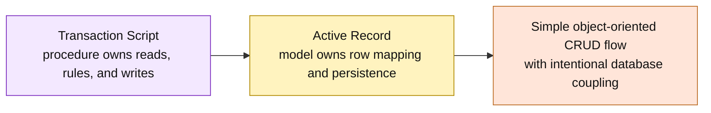

# Lesson 000: From Transaction Script To Active Record

## Objective

Explain how Active Record changes the center of gravity from transaction procedures and passive records to persistence-aware model objects.

## Theory

Transaction Script organizes behavior around a procedure. The procedure reads maps or tables, checks the rules, changes records, and writes the result. The records mostly carry data.

Active Record puts the storage mapping on the record itself. An Active Record knows enough about its database connection or table to:

- load a record by identity
- validate the data it is responsible for
- save its current state
- expose small business operations close to that state

The model therefore combines two responsibilities that other architectures often separate:

- domain data and behavior
- persistence for that data

That combination is useful for CRUD-oriented applications and simple workflows because a caller can work with an object and then ask that same object to save itself. The tradeoff is deliberate coupling: the model now knows about persistence, which can make testing, database changes, and larger cross-record workflows harder.

## Why This Matters Here

The completed Transaction Script track made storage coupling visible in every procedure. Active Record moves some of that coupling into the records instead:

- `FindCustomer` reconstructs a `Customer` Active Record from the database
- `NewDraftQuote` applies the first quote-creation checks
- `Quote.Save` persists the quote through the database known by the record

This is not a return to the richer DDD aggregate model. The first Active Record slice will keep the model close to its stored row and will not introduce repositories, ports, or a separate domain layer.

## Diagram

Legend:

- purple: procedure-centered behavior
- yellow: persistence-aware record behavior
- orange: the coupling tradeoff made explicit

## Implementation Focus

This is a transition lesson. It establishes the vocabulary and comparison point for the Active Record track and deliberately adds no application code yet.

The next lesson will implement only the first draft-quote slice with an in-memory database standing in for a relational connection.

## What To Verify

- the difference between a passive record and a persistence-aware Active Record is clear
- Active Record is understood as a pragmatic coupling choice, not as a richer aggregate model
- the next lesson can begin with `Customer` and `Quote` records that can find and save themselves
- later repositories, ports, quote lines, approvals, and reports remain intentionally out of scope
