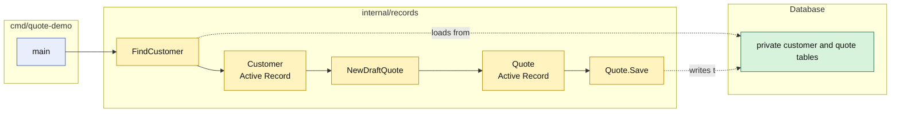

# Lesson 001: Active Record Skeleton

## Objective

Build the first runnable Active Record slice: persist a customer, load it as an Active Record, create a draft quote for an active customer, and save the quote through its own model.

## Theory

Active Record models combine a stored row with the operations needed to load and persist that row. In this lesson:

- `Customer` carries its customer fields and is loaded with `FindCustomer`
- `Quote` carries its quote fields and is loaded with `FindQuote`
- both records retain a reference to the `Database` that stores them
- `Quote.Save` writes the record without a repository object in between

The first business rule is also kept close to the model workflow: a draft quote can be created only for an existing, active customer. The quote is returned as an unsaved Active Record and the caller invokes `Save`, making the persistence step visible in the code.

This solves the small-application problem of making ordinary record operations easy to follow. The tradeoff is that model code is now coupled to the database shape and can become a large place for unrelated workflow rules as the application grows.

## Why This Matters Here

The previous Transaction Script skeleton used a procedure that reached directly into public maps. This lesson changes the visible seam:

- the database keeps its tables private
- callers use `FindCustomer` rather than reading the customer table
- callers use `Quote.Save` rather than writing the quote table
- no generic repository, port, or application-service abstraction hides the Active Record behavior

The in-memory database is only a testable stand-in for a real connection. The important architectural choice is that each model knows how to map itself to that persistence boundary.

## Diagram

Legend:

- blue: delivery edge
- yellow: Active Record model and model operations
- green: private persistence tables
- solid arrows: runtime calls
- dashed arrows: record-to-table mapping

## Implementation Focus

Implement only:

- a standalone Go module for the Active Record track
- an in-memory `Database` with private customer and quote tables
- `Customer` and `Quote` Active Records that retain their database connection
- `FindCustomer`, `FindQuote`, and `Save` operations on the records
- `NewDraftQuote` with unknown-customer and inactive-customer checks
- tests for persistence, successful draft creation, and rejected customers
- a CLI composition root that seeds a customer and runs the Active Record flow

Deliberately leave quote lines, approval, inventory, repositories, ports, and separate application services for later lessons.

## What To Verify

- `go test ./...` passes from `active-record-architecture/`
- `go run ./cmd/quote-demo` creates and reloads a draft quote
- the database tables remain private to the records package
- inactive and unknown customers are rejected
- `Quote.Save` and `FindQuote` demonstrate the persistence-aware model directly
