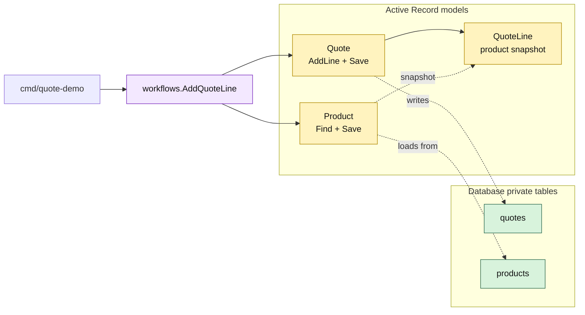

# Lesson 002: Add A Quote Line With Active Records

## Objective

Add a `Product` Active Record and let a loaded `Quote` Active Record append and persist a product snapshot as a quote line.

## Theory

Active Record does not require every workflow to become a large model method. A useful split for this lesson is:

- the workflow loads the quote and product records;
- `Quote.AddLine` owns the quote-specific editability and line-shape rules;
- `Product` owns its stored catalog facts;
- `Quote.Save` persists the changed record and its embedded lines.

This keeps the persistence operation on the model while allowing a small coordinating function to connect two records. The tradeoff is that the quote method knows enough about product snapshots and the database-backed model can become a busy place as more rules arrive.

## Why This Matters Here

The first lesson proved that records can find and save themselves. This lesson tests the pattern across a relationship:

- `Product` is loaded through `FindProduct`, not a public map;
- `Quote.AddLine` creates a snapshot rather than retaining a mutable product pointer;
- the workflow calls `quote.Save()` after the model changes;
- the line survives a later `FindQuote` round trip.

The code still avoids repositories and ports. The Active Record boundary is the model’s connection to the private tables.

## Diagram

Legend:

- purple: cross-record workflow
- yellow: Active Record models and embedded snapshot
- green: private persistence tables
- dashed arrows: model-to-table mapping or snapshot creation

## Implementation Focus

Implement only:

- a persistence-aware `Product` record
- `QuoteLine` data embedded in the `Quote` Active Record
- `Quote.AddLine` with quantity, product, and draft-status checks
- a small `AddQuoteLine` workflow that loads records and saves the quote
- tests for the successful and rejected paths
- a CLI demo that creates a quote and adds one product line

Leave quote submission, approval policy, pricing plugins, and order conversion for later lessons.

## What To Verify

- `go test ./...` passes from `active-record-architecture/`
- the CLI creates a draft quote and adds one line
- the line contains a product snapshot and calculated total
- inactive or unknown products, invalid quantities, unknown quotes, and non-draft quotes are rejected
- the workflow coordinates records while `Quote.AddLine` and `Quote.Save` own model behavior and persistence
