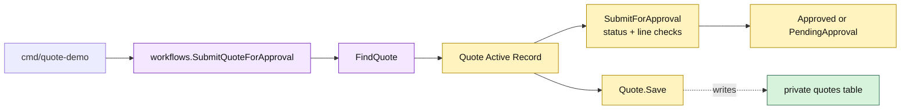

# Lesson 003: Submit A Quote For Approval With Active Records

## Objective

Add the first Active Record lifecycle operation: a loaded draft quote evaluates its lines and persists either `Approved` or `PendingApproval`.

## Theory

Submission is more than changing a status field. The `Quote` Active Record now owns the local lifecycle operation:

1. require the quote to be in `Draft`;
2. require at least one line;
3. inspect the line snapshots for an approval-triggering category;
4. choose the next status.

The workflow still owns loading and saving because it coordinates the persistence boundary. The model owns the quote-specific transition. This is a useful Active Record compromise: behavior is closer to the data, but the model remains coupled to stored fields and can grow large.

## Why This Matters Here

The previous lesson put line mutation on `Quote`. This lesson shows that the same model can protect a lifecycle transition after being reconstructed from storage:

- `FindQuote` returns a quote with its persisted lines;
- `Quote.SubmitForApproval` reads those lines and changes its own status;
- the workflow calls `Quote.Save` after the transition.

The approval rule is intentionally simple and local for now. A separate approval policy will be introduced later when the rule becomes a reusable decision boundary.

## Diagram

Legend:

- purple: workflow coordination
- yellow: Active Record lifecycle behavior
- green: persistence table
- dashed arrow: model persistence mapping

## Implementation Focus

Implement only:

- `PendingApproval` and `Approved` quote statuses
- `Quote.SubmitForApproval`
- a `SubmitQuoteForApproval` workflow that loads, invokes, and saves the quote
- empty-quote, non-draft, standard-quote, and `CustomBuild` paths
- tests for the resulting transitions
- a CLI demo that submits the quote after adding a line

Leave explicit approval/rejection commands, approval records, order conversion, and extracted approval policies for later lessons.

## What To Verify

- `go test ./...` passes from `active-record-architecture/`
- a standard quote becomes `Approved`
- a `CustomBuild` quote becomes `PendingApproval`
- an empty or non-draft quote cannot be submitted
- the quote owns the transition while the workflow only coordinates loading and saving
