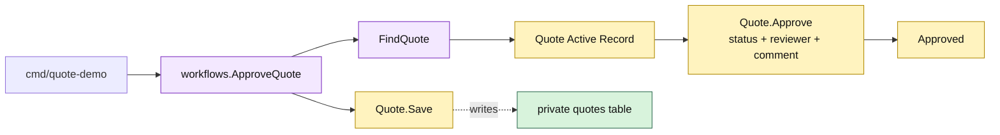

# Lesson 004: Approve A Pending Quote With Active Records

## Objective

Add an explicit approval operation that moves a `PendingApproval` quote to `Approved` and persists reviewer metadata through the Active Record.

## Theory

Submission and approval are separate business transactions. Submission decides that a review is needed; approval is a later command over a quote waiting in that state.

The `Quote` Active Record now gets an `Approve` method that owns the quote-local transition:

- the reviewer identity is required;
- only `PendingApproval` is valid;
- the status and review metadata change together.

The workflow loads and saves the record. This keeps persistence-aware behavior visible while avoiding direct table mutation.

## Why This Matters Here

The previous lesson introduced a status but not a constrained command. This lesson proves that the state transition still works after `FindQuote` reconstructs the model from its private table. It also makes the Active Record tradeoff sharper: review metadata is convenient to add to the row, but a growing audit history could eventually outgrow the model.

## Diagram

Legend:

- purple: workflow coordination
- yellow: Active Record transition and state
- green: persistence table
- dashed arrow: model persistence mapping

## Implementation Focus

Implement only:

- reviewer and decision-comment fields on `Quote`
- `Quote.Approve`
- an `ApproveQuote` workflow
- validation for missing reviewers, unknown quotes, and non-pending quotes
- tests for valid approval and rejected transitions

Leave rejection, approval decision extraction, audit history, and order conversion for later lessons.

## What To Verify

- `go test ./...` passes from `active-record-architecture/`
- a `PendingApproval` quote becomes `Approved`
- reviewer and decision comment survive `Quote.Save` and `FindQuote`
- draft and already-approved quotes cannot be approved
- the workflow coordinates persistence while `Quote.Approve` owns the row behavior
