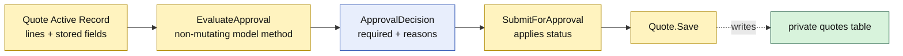

# Lesson 005: Extract The Approval Rule Into The Active Record

## Objective

Give `Quote` a reusable, non-mutating approval decision method and make submission consume that result.

## Theory

`SubmitForApproval` currently performs two jobs:

1. it coordinates a lifecycle transition;
2. it scans stored line snapshots for the rule that requires review.

The Active Record response is a named model operation rather than a repository or policy interface. `Quote.EvaluateApproval` returns an `ApprovalDecision` with deterministic reason codes and does not change or save the record. `Quote.SubmitForApproval` then applies that decision and remains the only method that changes the status.

This improves reuse without pretending that the rule is independent of the quote row shape. The tradeoff is that more policy knowledge now lives inside a persistence-aware model.

## Why This Matters Here

The previous lesson showed a lifecycle method on a loaded record. This lesson gives that method a smaller, testable decision step:

- callers can inspect approval findings without mutating the quote;
- submission still persists through `Quote.Save`;
- the reason code is part of the model-level result;
- no generic policy service or dependency-inversion boundary is introduced.

## Diagram

Legend:

- yellow: persistence-aware model behavior
- blue: decision value returned without mutation
- green: persistence table
- dashed arrow: final save mapping

## Implementation Focus

Implement only:

- an `ApprovalDecision` result with deterministic reason codes
- `Quote.EvaluateApproval`
- `Quote.SubmitForApproval` using that method
- tests proving evaluation is non-mutating and status transitions remain unchanged

Do not add approval records, policy interfaces, or manager workflow changes yet.

## What To Verify

- `go test ./...` passes from `active-record-architecture/`
- standard quotes return no approval reasons
- a `CustomBuild` line requires review
- evaluating approval does not mutate or save the quote
- submission still persists `Approved` or `PendingApproval`
