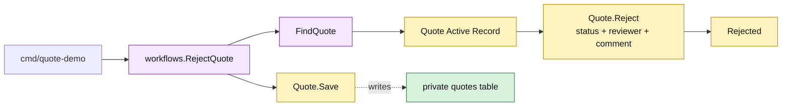

# Lesson 006: Reject A Pending Quote With Active Records

## Objective

Add the rejection operation that moves a `PendingApproval` quote to `Rejected` and persists the reviewer’s decision.

## Theory

Approval and rejection are sibling transactions over the same review state. The Active Record pattern keeps the quote-local state guard and row mutation together:

- `Quote.Reject` requires a reviewer;
- only `PendingApproval` can be rejected;
- status, reviewer, and explanation are updated as one model operation;
- the workflow saves the changed Active Record.

The direct model approach is compact, but related commands still share a growing set of status and metadata assumptions. That repetition is a pressure to observe as the track grows.

## Why This Matters Here

The review branch is now complete in both directions. The quote can be loaded from private storage and can protect its own next transition without callers assigning status fields directly.

This is still not an approval aggregate or an audit subsystem. Review information remains columns on the persistence-aware `Quote`, which is convenient now and intentionally limited.

## Diagram

Legend:

- purple: workflow coordination
- yellow: Active Record transition and state
- green: persistence table
- dashed arrow: model persistence mapping

## Implementation Focus

Implement only:

- `Quote.Reject`
- a `RejectQuote` workflow
- reviewer and comment persistence
- valid and invalid rejection tests
- a CLI demonstration of the rejected branch

Leave order conversion, inventory coordination, and review-history modeling for later lessons.

## What To Verify

- `go test ./...` passes from `active-record-architecture/`
- only a pending quote can be rejected
- reviewer identity is required
- rejection metadata survives a save/load round trip
- an approved or draft quote remains unchanged when rejection is refused
