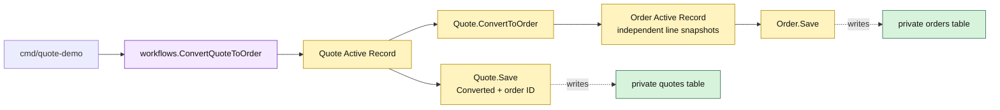

# Lesson 007: Convert An Approved Quote Into An Order

## Objective

Add the first cross-record Active Record operation: convert an approved quote into an independent order snapshot.

## Theory

Quote and order represent different business moments. A quote is negotiable; an order is committed. `Quote.ConvertToOrder` therefore:

1. requires an approved quote and a requester;
2. copies the commercial line snapshots into a new `Order` Active Record;
3. marks the quote as converted and records the new order ID.

The workflow saves both persistence-aware records. The order does not retain a pointer to the quote’s slice, so later quote changes cannot rewrite committed data.

Inventory reservation is intentionally not included yet. Keeping that side effect out of this lesson makes the quote-to-order boundary visible before it grows.

## Why This Matters Here

This is the first operation that joins two Active Records. The model-led approach keeps the snapshot construction and quote lifecycle rule close to `Quote`, while `Order.Save` owns order-row persistence. The tradeoff is that `Quote` now knows about the order table and can become tightly coupled to neighboring workflows.

## Diagram

Legend:

- purple: cross-record workflow
- yellow: Active Record behavior and snapshots
- green: private persistence tables
- dashed arrows: model-to-table mapping

## Implementation Focus

Implement only:

- `Order` and `OrderLine` Active Records
- order storage and sequential IDs
- `Converted` quote state and source-order metadata
- `Quote.ConvertToOrder`
- tests for approved conversion, independent snapshots, and rejected source states
- a CLI conversion of the standard quote

Leave inventory reservation, payment, and shipment for later lessons.

## What To Verify

- `go test ./...` passes from `active-record-architecture/`
- only an approved quote converts
- the order receives independent line snapshots
- the quote records its converted order
- conversion does not reserve stock yet
