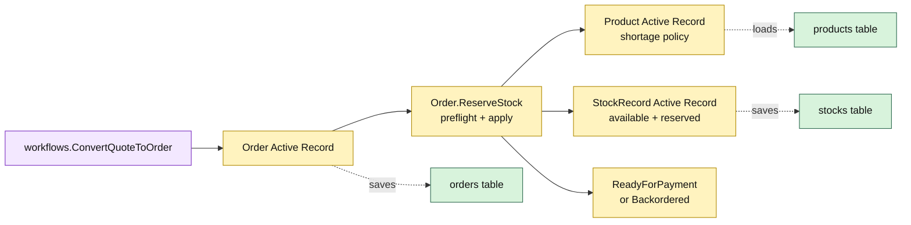

# Lesson 008: Convert The Order And Reserve Stock

## Objective

Extend quote-to-order conversion so the order Active Record preflights inventory, reserves available stock, and records a ready-for-payment or backordered state.

## Theory

Conversion now coordinates three persistence-aware record types:

1. `Quote` creates the committed order snapshot;
2. `Order.ReserveStock` checks every line and the product shortage policy;
3. `StockRecord.Reserve` changes the inventory row.

The reservation method performs a complete preflight before applying any stock changes. A hard shortage therefore does not leave a partial order, converted quote, or reservation behind. An allowed shortage creates a backordered order without reserving unavailable quantity.

This is convenient for a small Active Record application because the order can reach across its database connection to related rows. The tradeoff is strong coupling between the model and cross-record persistence semantics.

## Why This Matters Here

The previous lesson stopped at a `PendingReservation` order. This lesson makes the Active Record coupling concrete:

- `Product` stores the shortage policy with its catalog row;
- `StockRecord` owns its row-level available/reserved arithmetic;
- `Order.ReserveStock` coordinates several Active Records and changes the order lifecycle;
- `Quote.Save`, `Order.Save`, and `StockRecord.Save` persist the successful transaction.

No repository, unit-of-work, or inventory port hides this sequence yet.

## Diagram

Legend:

- purple: workflow entry point
- yellow: Active Record coordination and behavior
- green: private persistence tables
- dashed arrows: record persistence or lookup mapping

## Implementation Focus

Implement only:

- `StockRecord` Active Record and shortage-policy fields on `Product`
- stock storage and reservation arithmetic
- `Order.ReserveStock`
- hard-shortage rejection and allow-backorder behavior
- conversion tests for complete reservation, insufficient stock, and backorder
- demo stock sufficient for the standard order

Leave payment capture and shipment creation for later lessons.

## What To Verify

- `go test ./...` passes from `active-record-architecture/`
- successful conversion increments reserved stock and becomes `ReadyForPayment`
- a hard shortage creates no order, changes no quote, and reserves nothing
- an allowed shortage creates a `Backordered` order
- the preflight prevents partial persistence
