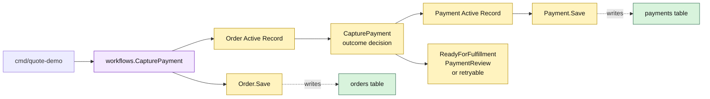

# Lesson 009: Capture Payment For A Reserved Order

## Objective

Add a payment Active Record and let a ready order capture an accepted, failed, or review outcome while persisting both records.

## Theory

Payment is a second side effect after inventory reservation. `Order.CapturePayment` now coordinates the model-level operation:

1. require `ReadyForPayment`;
2. normalize and validate the simulated outcome;
3. create and save a `Payment` Active Record for the order total;
4. update the order payment fields and lifecycle status.

The payment record knows how to save itself, while the order owns the relationship between payment outcome and order status. The tradeoff is that the order model now knows payment persistence and outcome vocabulary; replacing a real gateway later would require a deliberate boundary.

## Why This Matters Here

Inventory and payment are different forms of business side effect, but Active Record keeps both close to the records they change:

- `Payment.Save` persists the attempt;
- `Order.CapturePayment` updates the order row;
- the workflow only loads the order, invokes the method, and saves the order.

The review state is introduced but its approval command is intentionally left for a later lesson.

## Diagram

Legend:

- purple: workflow entry point
- yellow: Active Record behavior and state
- green: private persistence tables
- dashed arrows: persistence mapping

## Implementation Focus

Implement only:

- payment status values and a `Payment` Active Record
- payment storage and sequential payment IDs
- `Order.CapturePayment`
- accepted, failed, manual-review, and invalid-state tests
- a CLI capture of the reserved standard order

Leave payment-review approval and shipment creation for later lessons.

## What To Verify

- `go test ./...` passes from `active-record-architecture/`
- accepted payment creates a payment and makes the order ready for fulfillment
- failed payment leaves the order retryable
- review outcome moves the order to `PaymentReview`
- orders that are not ready for payment cannot be captured
