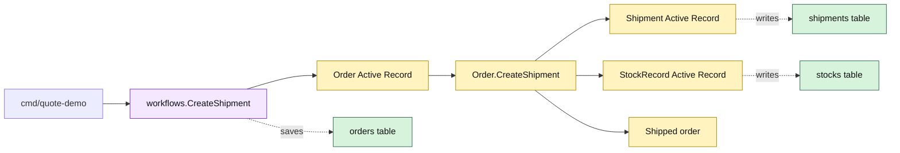

# Lesson 010: Create A Shipment After Payment

## Objective

Add a shipment Active Record that ships a paid order and consumes the stock reserved during conversion.

## Theory

Shipment is a separate persistence row, but the operation must keep three Active Records consistent:

1. `Order.CreateShipment` requires `ReadyForFulfillment` and derives the remaining reserved quantities;
2. `Shipment.Save` persists the fulfillment record;
3. `StockRecord` rows consume both on-hand and reserved quantities;
4. the order records the shipped quantities and final status.

The method performs validation before applying inventory changes. The workflow then saves the changed order. This keeps the full sequence visible in the Active Record model and exposes the tradeoff: fulfillment logic now reaches across order, shipment, and stock tables.

## Why This Matters Here

This lesson completes the first chain:

`Quote -> Order -> Reservation -> Payment -> Shipment`

Active Record makes the happy path compact because each model owns its persistence. It also makes the coupling concrete: adding partial shipment, retries, or concurrency control will put more cross-record knowledge around the order model.

## Diagram

Legend:

- purple: workflow entry point
- yellow: Active Record behavior and state
- green: private persistence tables
- dashed arrows: persistence mapping

## Implementation Focus

Implement only:

- `Shipment` and `ShipmentLine` Active Records
- shipment storage and IDs
- a full-order `Order.CreateShipment` operation
- payment-gate and missing-reservation validation
- tests proving shipment persistence and stock consumption
- the CLI happy path through shipment

Leave cancellation, partial shipment, and shipment queries for later lessons.

## What To Verify

- `go test ./...` passes from `active-record-architecture/`
- only a paid/fulfillable order can ship
- the shipment is persisted with all remaining lines
- order status becomes `Shipped`
- on-hand and reserved quantities are consumed exactly once
