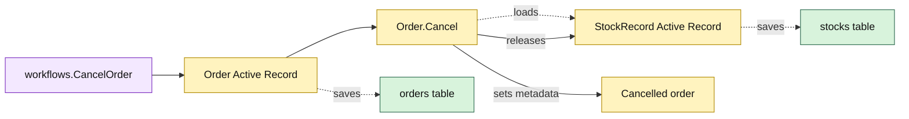

# Lesson 011: Cancel An Order And Release Reserved Stock

## Objective

Add cancellation behavior to the `Order` Active Record so an unshipped order releases its outstanding inventory reservation and records who cancelled it.

## Theory

Cancellation is a reverse lifecycle operation, not only a status assignment. The `Order.Cancel` method will:

1. validate the order state, actor, and reason;
2. preflight every outstanding reservation against its `StockRecord`;
3. release each reservation and persist the stock rows;
4. clear the order-line reservation snapshots;
5. record cancellation metadata and set `Cancelled`.

The workflow loads the order and saves it after the model method succeeds. The model owns the cross-record operation while the workflow remains a thin application entry point.

## Why This Matters Here

Active Record keeps the cancellation command easy to discover on `Order`, but the model now knows about inventory tables and reservation arithmetic. That is useful for a small system and also makes the growing responsibility visible as the order lifecycle expands.

## Diagram

Legend:

- purple: application workflow;
- yellow: Active Record behavior and state;
- green: private persistence tables;
- dashed arrows: load and persistence mapping.

## Implementation Focus

Implement only:

- `Cancelled` order state and cancellation metadata;
- `StockRecord.Release` reservation arithmetic;
- `Order.Cancel` with preflight validation;
- a thin `CancelOrder` workflow;
- tests proving release happens once and invalid cancellation leaves state unchanged.

Leave returns, refunds, and partial shipment for later lessons.

## What To Verify

- `go test ./...` passes from `active-record-architecture/`;
- an unshipped order becomes `Cancelled`;
- reserved stock is released exactly once;
- a shipped or already-cancelled order cannot be cancelled;
- missing actor/reason or invalid stock leaves the order and stock unchanged.
