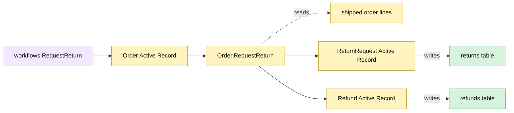

# Lesson 012: Request A Return And Record Refund State

## Objective

Introduce `ReturnRequest` and `Refund` Active Records, then let a shipped order create a return request without changing inventory.

## Theory

Returns begin after shipment and are distinct from cancellation. `Order.RequestReturn` will:

1. require a shipped or partially shipped order;
2. derive all remaining returnable shipped lines when no lines are supplied;
3. validate explicit quantities against shipped minus already returned quantities;
4. create a `Requested` return record with a calculated refund amount;
5. create a `NotStarted` refund record for a later decision.

The request records are persistence-aware but intentionally passive. The order owns the cross-record operation, while the workflow only loads the order and invokes it.

## Why This Matters Here

The forward path now has a post-shipment entry point. Active Record makes the operation discoverable on `Order`, but the order model must understand return-line arithmetic and coordinate two more tables. No stock is restocked and no refund is completed at request time.

## Diagram

Legend:

- purple: application workflow;
- yellow: Active Record behavior and state;
- green: private persistence tables;
- dashed arrows: reads and persistence mapping.

## Implementation Focus

Implement only:

- return and refund status values;
- `ReturnLine`, `ReturnRequest`, and `Refund` Active Records;
- return/refund storage and sequential IDs;
- `Order.RequestReturn` and a thin workflow;
- shipped-state, quantity, default-line, and refund-state tests.

Leave review decisions, restocking, eligibility policy, actor metadata, and idempotency for later lessons.

## What To Verify

- `go test ./...` passes from `active-record-architecture/`;
- only shipped or partially shipped orders can create returns;
- requested quantities cannot exceed remaining returnable quantities;
- a request starts in `Requested` state;
- its refund starts in `NotStarted` state and stock is unchanged.
