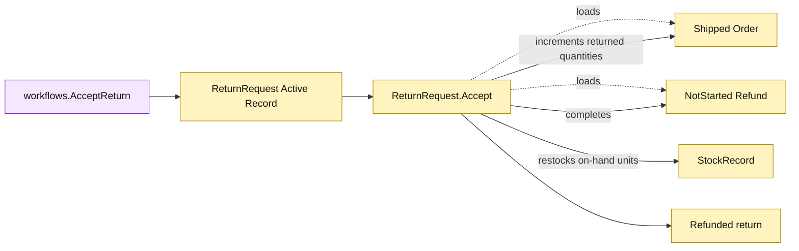

# Lesson 013: Accept A Return, Refund, And Restock

## Objective

Add a compressed return-acceptance operation that marks returned quantities, restocks inventory, and completes the linked refund.

## Theory

At this stage the `ReturnRequest` Active Record will expose `Accept`, which will:

1. require a `Requested` return;
2. load its shipped order and linked refund;
3. preflight every requested line and its stock row;
4. increase returned quantities on the order;
5. increase on-hand stock without touching reservations;
6. complete the refund and mark the return `Refunded`.

The operation persists the related Active Records after validation. It deliberately compresses review, financial completion, and restocking into one command; the next lesson will introduce an explicit review boundary.

## Why This Matters Here

The forward path consumed reserved stock during shipment. This reverse path restores on-hand inventory after shipment. Active Record makes the behavior readable on `ReturnRequest`, but the model now coordinates return, order, refund, and stock tables in one method.

## Diagram

Legend:

- purple: application workflow;
- yellow: Active Record behavior, state, and reverse side effects;
- dashed arrows: record loads;
- solid arrows: mutation or lifecycle transition.

## Implementation Focus

Implement only:

- `Refunded` and `Completed` status values;
- `ReturnRequest.Accept` reverse-side-effect behavior;
- returned-quantity and on-hand restocking arithmetic;
- linked refund completion;
- tests for successful acceptance, invalid lines, and repeated acceptance.

Leave explicit accept/reject review states, eligibility policy, actor metadata, and idempotency for later lessons.

## What To Verify

- `go test ./...` passes from `active-record-architecture/`;
- accepting a requested return completes its refund;
- shipped quantities become returned quantities;
- on-hand stock increases by the returned quantity while reservations stay unchanged;
- invalid or repeated acceptance performs no second side effect.
