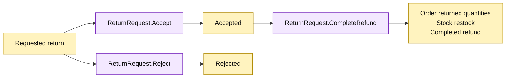

# Lesson 014: Separate Return Review From Refund Processing

## Objective

Split return processing into explicit review and completion operations so rejected returns never restock inventory or complete a refund.

## Theory

The previous Active Record compressed the lifecycle:

`Requested -> Refunded`

This lesson introduces three model operations:

- `ReturnRequest.Accept`: `Requested -> Accepted`;
- `ReturnRequest.Reject`: `Requested -> Rejected`;
- `ReturnRequest.CompleteRefund`: accepted-only order, stock, and refund side effects.

Review now persists a decision without changing inventory. Completion reuses the previous preflight and reverse arithmetic, but it cannot run for a rejected or merely requested return.

## Why This Matters Here

Active Record does not require one giant lifecycle method. Focused methods make the review boundary visible while the model still coordinates related persistence rows. The cost is that the return record now carries more legal states and each method must enforce its own transition rules.

## Diagram

Legend:

- purple: Active Record operations;
- yellow: persisted lifecycle states and side effects;
- arrows: allowed transitions.

## Implementation Focus

Implement only:

- `Accepted` and `Rejected` return states;
- explicit `Accept` and `Reject` Active Record operations;
- `CompleteRefund` for accepted returns;
- review-note persistence;
- tests proving rejection blocks side effects and acceptance requires separate completion.

Leave reviewer metadata, eligibility policy, return windows, and idempotency for later lessons.

## What To Verify

- `go test ./...` passes from `active-record-architecture/`;
- requested returns can be accepted or rejected;
- rejected returns cannot be refunded or restocked;
- accepted returns do not change inventory until completion runs;
- only accepted returns can complete a refund.
