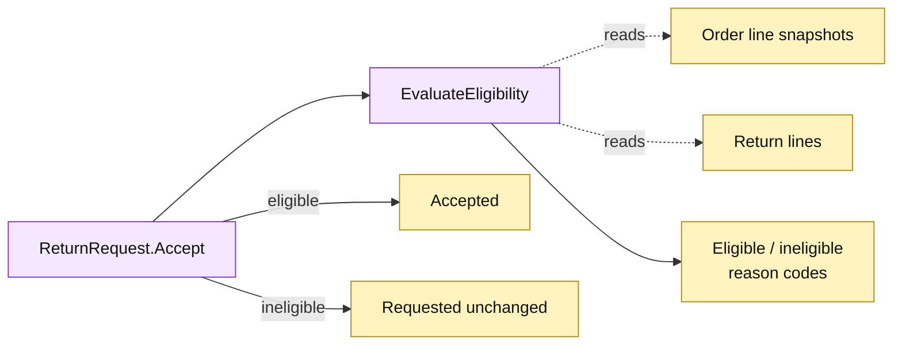

# Lesson 015: Add An Active Record Return Eligibility Check

## Objective

Introduce a reusable return-eligibility decision and apply it before a return can enter the `Accepted` state.

## Theory

Structural quantity validation does not answer whether a return is allowed by product policy. This lesson adds a non-mutating `ReturnRequest.EvaluateEligibility` operation with the first rule:

- clearance products are not returnable.

`Accept` loads the order, evaluates the request, and refuses the transition when the decision is ineligible. The decision carries stable reason codes so callers and tests can explain the refusal without changing records.

## Why This Matters Here

The return Active Record now contains both lifecycle persistence and policy knowledge derived from order-line snapshots. That keeps acceptance local and readable, while making the coupling to historical product data explicit.

## Diagram

Legend:

- purple: Active Record behavior;
- yellow: persisted records and decision value;
- dashed arrows: policy reads;
- solid arrows: transition or refusal result.

## Implementation Focus

Implement only:

- an eligibility decision value and stable reason code;
- `ReturnRequest.EvaluateEligibility` for clearance and normal products;
- eligibility enforcement in `Accept`;
- tests proving ineligible requests remain `Requested` and cause no side effects.

Leave date windows and clock handling for the next lesson.

## What To Verify

- `go test ./...` passes from `active-record-architecture/`;
- clearance returns are refused before acceptance;
- normal returns remain eligible;
- evaluating eligibility does not mutate the order or request;
- accepted returns still require the separate refund-completion operation.
