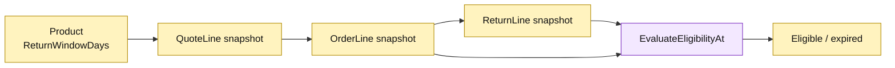

# Lesson 016: Enforce A Real Return Window

## Objective

Use shipment timestamps and product return-window snapshots to reject returns requested after their allowed date.

## Theory

Clearance policy is only one eligibility rule. This lesson completes the historical data path:

`Product.ReturnWindowDays -> QuoteLine -> OrderLine -> ReturnLine`

`ReturnRequest.EvaluateEligibilityAt` compares the requested time with `Order.ShippedAt` plus the line's window. The production methods still use `time.Now()`, while `RequestReturnAt` and `AcceptReturnAt` make tests and demonstrations deterministic. Legacy snapshots with no window use a 30-day default.

## Why This Matters Here

The Active Record model now evaluates a rule that depends on data captured at several earlier lifecycle points. Snapshotting protects the commercial decision from later catalog edits, but it also expands the amount of historical state the model must carry.

## Diagram

Legend:

- yellow: persisted snapshots and decision value;
- purple: Active Record policy evaluation;
- arrows: snapshot propagation or policy input.

## Implementation Focus

Implement only:

- return-window fields and their snapshot propagation;
- a 30-day default for missing legacy windows;
- date-aware eligibility evaluation;
- deterministic `RequestReturnAt` and `AcceptReturnAt` seams;
- tests for inside and outside windows.

Leave requester/reviewer/processor actors for the next lesson.

## What To Verify

- `go test ./...` passes from `active-record-architecture/`;
- a return inside its window remains eligible;
- a return after its window is refused;
- shipment time and window values survive the snapshot chain;
- no clock interface or unrelated persistence abstraction is introduced.
