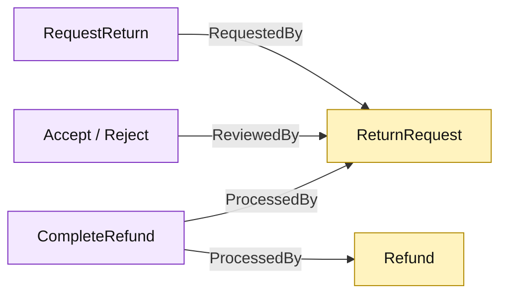

# Lesson 017: Record Return Actors

## Objective

Require and persist requester, reviewer, and refund-processor identities across the return Active Record lifecycle.

## Theory

The return flow has three operational moments:

- request the return;
- review and accept or reject it;
- complete the refund and restock.

This lesson adds plain actor fields to the return and refund records:

- `RequestedBy` on request creation;
- `ReviewedBy` on accept and reject;
- `ProcessedBy` on refund completion and the linked `Refund`.

Each Active Record operation validates its required actor before changing state or applying side effects.

## Why This Matters Here

Active Record can preserve operational accountability without introducing a separate audit service. The cost is visible in wider command signatures and repeated actor validation at each lifecycle boundary.

## Diagram

Legend:

- purple: Active Record operations;
- yellow: persisted business and audit metadata;
- arrows: actor values written by each operation.

## Implementation Focus

Implement only:

- actor-required validation;
- requester, reviewer, and processor parameters;
- persistence of actor fields on return and refund records;
- tests for valid metadata and missing actors.

Leave command idempotency for the next lesson.

## What To Verify

- `go test ./...` passes from `active-record-architecture/`;
- request, review, and refund actors are stored;
- missing actors are rejected before state or side effects change;
- rejected returns store reviewer metadata without creating a completed refund.
