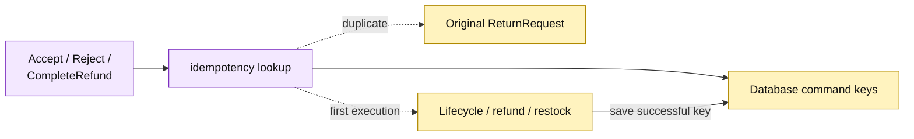

# Lesson 018: Make Return Commands Idempotent

## Objective

Make return review and refund-completion commands safe to retry by storing a command key and returning the original result for duplicates.

## Theory

The return lifecycle now has meaningful state and inventory/financial side effects. A timeout or double submission must not:

- review the same request twice;
- create a second refund completion;
- restock the same goods twice.

`Database` will keep a private command-to-return mapping. `Accept`, `Reject`, and `CompleteRefund` require an idempotency key, record it only after successful completion, and return the original persisted `ReturnRequest` when the same command/key is seen again.

## Why This Matters Here

Active Record can own retry bookkeeping beside its persistence operations, keeping workflows small. The tradeoff is that every new side-effecting command must remember the same convention and choose a stable command name and key boundary.

## Diagram

Legend:

- purple: retry-aware Active Record command path;
- yellow: persisted key and business records;
- dashed arrows: duplicate short-circuit or first-execution branch;
- solid arrows: lookup and successful key persistence.

## Implementation Focus

Implement only:

- a private idempotency map in `Database`;
- required command keys;
- duplicate short-circuit behavior for accept, reject, and refund completion;
- tests proving refund/restock happen once and rejected retries return the original result.

Leave query surfaces for later lessons.

## What To Verify

- `go test ./...` passes from `active-record-architecture/`;
- missing keys are rejected;
- repeating a successful accept returns the original request;
- repeating refund completion does not create a second refund or restock twice;
- repeating rejection returns the original rejected request.
