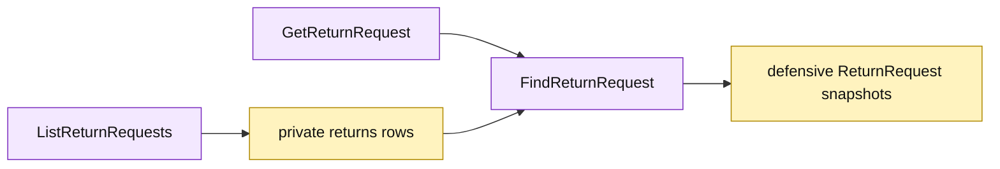

# Lesson 019: Add A Return Query Surface

## Objective

Expose return reads through `GetReturnRequest` and `ListReturnRequests` without leaking the private return table.

## Theory

Return records now contain lifecycle state, actors, refund metadata, line snapshots, and retry history. The query surface will:

- load one request by ID;
- list requests with an optional status filter;
- sort results deterministically by return ID;
- reconstruct each result through the Active Record loader so returned line slices are defensive copies.

These functions are read-only. They do not reuse command methods or mutate the database.

## Why This Matters Here

Active Record already gives callers a named `Find` operation for one record. A collection query extends that convention while keeping table layout private. The model remains responsible for translating rows into safe, persistence-aware snapshots.

## Diagram

Legend:

- purple: Active Record query operations;
- yellow: private persistence rows and reconstructed records;
- arrows: read and snapshot flow.

## Implementation Focus

Implement only:

- `GetReturnRequest`;
- `ListReturnRequests` with an optional status filter;
- deterministic ID ordering and defensive line-slice copies;
- query tests for found, missing, filtered, and unfiltered cases.

Leave order, shipment, and quote query surfaces for later lessons.

## What To Verify

- `go test ./...` passes from `active-record-architecture/`;
- one return can be read by ID;
- missing IDs return the existing business error;
- status filtering and sorting work;
- modifying a returned line slice does not mutate the stored request.
