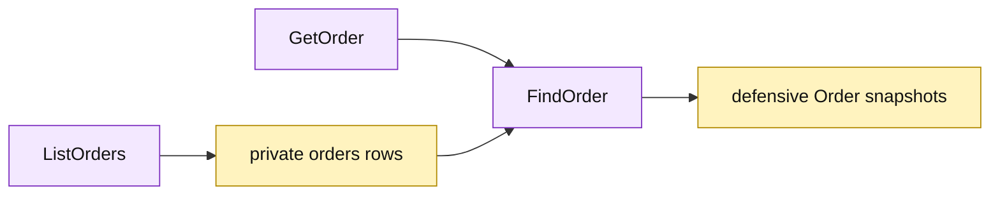

# Lesson 020: Add An Order Query Surface

## Objective

Expose order reads through `GetOrder` and `ListOrders` without exposing the private order table.

## Theory

Orders now carry quote snapshots, reservation state, payment state, fulfillment state, and cancellation metadata. The Active Record query surface will:

- load one order by ID;
- list orders with an optional status filter;
- sort by order ID;
- reconstruct each order so its line slice is independent of stored rows.

Queries remain read-only and do not call command methods such as payment, shipment, or cancellation.

## Why This Matters Here

The detail loader already protects the persistence boundary. Collection reads reuse that translation rather than returning internal rows, making the growing order shape safe to inspect without coupling callers to table layout.

## Diagram

Legend:

- purple: Active Record query operations;
- yellow: private persistence rows and reconstructed records;
- arrows: read and snapshot flow.

## Implementation Focus

Implement only:

- `GetOrder`;
- `ListOrders` with an optional status filter;
- deterministic order-ID sorting and defensive line copies;
- query tests for found, missing, filtered, and unfiltered results.

Leave shipment and quote query surfaces for later lessons.

## What To Verify

- `go test ./...` passes from `active-record-architecture/`;
- one order can be read by ID;
- missing orders return the existing business error;
- status filtering and sorting work;
- modifying a returned line slice does not mutate the stored order.
