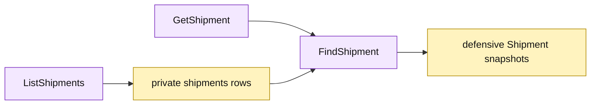

# Lesson 021: Add A Shipment Query Surface

## Objective

Expose shipment reads through `GetShipment` and `ListShipments` without exposing the private shipment table.

## Theory

Shipments are fulfillment history, distinct from the order’s current status. The Active Record query surface will:

- load one shipment by ID;
- list shipments with an optional order-ID filter;
- sort results by shipment ID;
- reconstruct shipments with independent line slices.

The queries are read-only and do not consume stock or change the order.

## Why This Matters Here

Order queries show current state; shipment queries show fulfillment history. Keeping the two read surfaces separate preserves that distinction while reusing the persistence-aware `Shipment` loader.

## Diagram

Legend:

- purple: Active Record query operations;
- yellow: private persistence rows and reconstructed records;
- arrows: read and snapshot flow.

## Implementation Focus

Implement only:

- `GetShipment`;
- `ListShipments` filtered by optional order ID;
- deterministic shipment-ID sorting and defensive line copies;
- query tests for found, missing, filtered, and unfiltered results.

Leave quote and catalog query surfaces for later lessons.

## What To Verify

- `go test ./...` passes from `active-record-architecture/`;
- a shipment can be read by ID;
- shipments can be listed by order;
- missing shipments return the existing business error;
- query snapshots cannot mutate stored lines.
