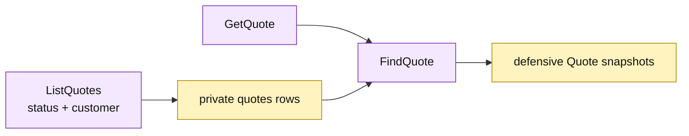

# Lesson 022: Add A Quote Query Surface

## Objective

Expose quote reads through `GetQuote` and `ListQuotes`, including optional status and customer filters.

## Theory

Quotes carry lifecycle state, product-line snapshots, review metadata, and conversion links. The Active Record query surface will:

- load one quote by ID;
- filter a collection independently by status and customer;
- sort by quote ID;
- reconstruct line slices through the persistence loader.

Queries do not approve, reject, edit, or convert quotes.

## Why This Matters Here

The query surface keeps the record shape private while making the two common filters explicit. Active Record keeps the implementation small, but the query still knows the table fields and filter semantics directly.

## Diagram

Legend:

- purple: Active Record query operations;
- yellow: private persistence rows and reconstructed records;
- arrows: read, filter, and snapshot flow.

## Implementation Focus

Implement only:

- `GetQuote`;
- `ListQuotes` with status and customer filters;
- deterministic quote-ID sorting and defensive line copies;
- tests for detail, filters, and missing quotes.

Leave product and customer query surfaces for later lessons.

## What To Verify

- `go test ./...` passes from `active-record-architecture/`;
- a quote can be read by ID;
- status and customer filters work independently and together;
- returned line slices do not mutate stored quotes.
