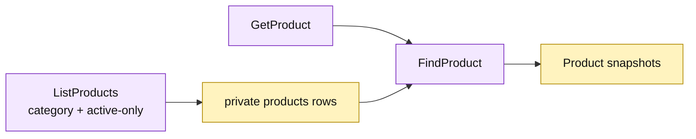

# Lesson 023: Add A Product Query Surface

## Objective

Expose catalog reads through `GetProduct` and `ListProducts` without exposing the private product table.

## Theory

Products feed quote snapshots, stock policy, pricing, and return eligibility. The Active Record query surface will:

- load one product by SKU;
- filter a collection by optional category and active-only criteria;
- sort by SKU;
- return reconstructed product records that are safe to mutate in memory.

The active-only filter is a read concern; it does not make inactive products unreadable when the filter is disabled.

## Why This Matters Here

The product record is now a shared input to several workflows. A named query surface gives callers a stable read seam while retaining the direct, data-centric Active Record tradeoff.

## Diagram

Legend:

- purple: Active Record query operations;
- yellow: private catalog rows and reconstructed records;
- arrows: read, filter, and snapshot flow.

## Implementation Focus

Implement only:

- `GetProduct`;
- `ListProducts` with category and active-only filters;
- deterministic SKU sorting;
- product query tests.

Leave customer queries for the next lesson.

## What To Verify

- `go test ./...` passes from `active-record-architecture/`;
- products can be read by SKU;
- category and active-only filters work;
- unavailable products can still be read when the filter is disabled.
