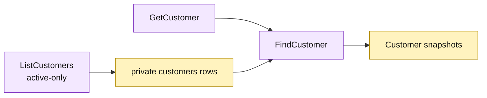

# Lesson 024: Add A Customer Query Surface

## Objective

Expose customer reads through `GetCustomer` and `ListCustomers`, including an active-only filter.

## Theory

Customers participate in quote creation and later commercial decisions. The Active Record query surface will:

- load one customer by ID;
- optionally exclude inactive customers from a collection;
- sort results by customer ID;
- return reconstructed customer records rather than private table rows.

The query does not change customer activity or enforce command rules.

## Why This Matters Here

The query layer is becoming a family of explicit Active Record operations rather than a generic repository abstraction. That keeps the read contract clear while repeated filtering and reconstruction remain visible.

## Diagram

Legend:

- purple: Active Record query operations;
- yellow: private customer rows and reconstructed records;
- arrows: read, filter, and snapshot flow.

## Implementation Focus

Implement only:

- `GetCustomer`;
- `ListCustomers` with an active-only option;
- deterministic customer-ID sorting;
- customer query tests.

Leave reporting projections for later lessons.

## What To Verify

- `go test ./...` passes from `active-record-architecture/`;
- a customer can be read by ID;
- active-only listing excludes inactive customers;
- unrestricted listing returns all customers in deterministic order.
