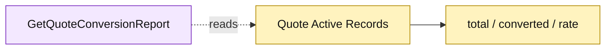

# Lesson 025: Build A Quote Conversion Report

## Objective

Add a read-only Active Record report that calculates quote-to-order conversion metrics from current quote rows.

## Theory

Reports are query projections, not new lifecycle commands. `GetQuoteConversionReport` will count total quotes, count converted quotes using the stored status/link, and calculate a deterministic conversion rate. It scans current records at read time and does not maintain a separate projection.

## Why This Matters Here

Direct scans are compact for a small in-memory database, but the report knows the quote persistence fields and metric rules. Active Record makes that read-model coupling visible rather than hiding it behind a generic reporting abstraction.

## Diagram

Legend:

- purple: report query operation;
- yellow: Active Record source and report value;
- dashed arrow: read-only scan.

## Implementation Focus

Implement only:

- a `QuoteConversionReport` read model;
- `GetQuoteConversionReport`;
- tests for empty, partial, and complete conversion sets.

Leave category reports and low-stock reporting for later lessons.

## What To Verify

- `go test ./...` passes from `active-record-architecture/`;
- total and converted quote counts are correct;
- conversion rate is zero for an empty set;
- the report does not mutate quotes.
