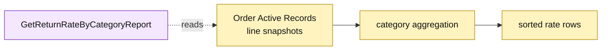

# Lesson 026: Report Return Rate By Category

## Objective

Add a read-only report that aggregates shipped and returned quantities by product category.

## Theory

Return records describe workflow state, but the metric should measure order facts. `GetReturnRateByCategoryReport` will scan order-line snapshots, group shipped and returned quantities by category, and calculate `returned / shipped` for each category. Empty categories are labeled `Unknown`, rows are sorted by category, and operational records remain unchanged.

## Why This Matters Here

The report is a small projection built from the write model at read time. Active Record keeps the scan compact, while the procedure directly depends on order-line fields and reporting semantics—useful coupling to recognize before a larger system needs a dedicated read model.

## Diagram

Legend:

- purple: report query operation;
- yellow: Active Record source and read model;
- dashed arrow: read-only scan.

## Implementation Focus

Implement only:

- category report row and report types;
- `GetReturnRateByCategoryReport`;
- deterministic category sorting;
- tests for multiple categories and zero-return categories.

Leave low-stock and approval reports for later lessons.

## What To Verify

- `go test ./...` passes from `active-record-architecture/`;
- shipped and returned quantities aggregate correctly;
- categories with no returns report a zero rate;
- no order or return record is mutated.
