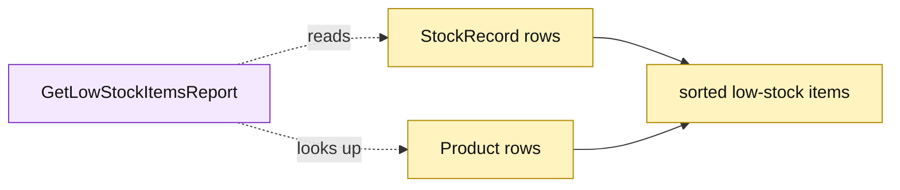

# Lesson 027: Build A Low-Stock Report

## Objective

Add a read-only report that identifies stock rows whose available quantity is at or below their reorder threshold.

## Theory

`StockRecord` stores on-hand, reserved, and reorder-threshold values. `GetLowStockItemsReport` will calculate `Available = OnHand - Reserved`, include rows at or below the threshold, optionally enrich them with product names, and sort by SKU. It never reserves, receives, or changes stock.

## Why This Matters Here

The report is useful and compact for the in-memory database, but it joins inventory and catalog persistence rows directly. Active Record keeps the code close to the data and makes the coupling clear if inventory later gains a dedicated projection.

## Diagram

Legend:

- purple: report query operation;
- yellow: Active Record source rows and read model;
- dashed arrows: read-only scan and enrichment;
- solid arrows: report shaping.

## Implementation Focus

Implement only:

- a low-stock report row;
- `GetLowStockItemsReport`;
- available-quantity calculation and deterministic SKU sorting;
- tests for threshold boundaries and missing product names.

Leave approval queue reporting for the next lesson.

## What To Verify

- `go test ./...` passes from `active-record-architecture/`;
- available quantity uses on-hand minus reserved;
- equal-to-threshold items are included;
- healthy stock is excluded;
- the report does not mutate inventory.
