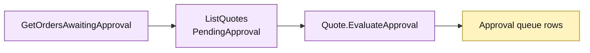

# Lesson 028: Report Quotes Awaiting Approval

## Objective

Add a read-only approval queue report for quotes in `PendingApproval` state.

## Theory

Managers need a queue view rather than a raw quote scan. `GetOrdersAwaitingApproval` will:

- select pending quote Active Records;
- reuse `Quote.EvaluateApproval` to project stable reasons;
- return customer and quote identifiers in deterministic quote-ID order;
- leave the quotes unchanged.

The historical name is preserved for the lesson contract even though the queue contains quotes awaiting approval.

## Why This Matters Here

Active Record lets a report reuse behavior already attached to the model. That improves consistency, while the report still knows the pending status and the shape of the approval read model.

## Diagram

Legend:

- purple: Active Record query and reusable model behavior;
- yellow: approval queue read model;
- arrows: filter, evaluate, and project flow.

## Implementation Focus

Implement only:

- an approval queue row type;
- `GetOrdersAwaitingApproval`;
- pending-quote filtering and reason projection;
- deterministic quote-ID ordering;
- report tests.

Leave payment review for the next lesson.

## What To Verify

- `go test ./...` passes from `active-record-architecture/`;
- only pending quotes appear;
- custom-build reasons are visible;
- approved and rejected quotes are excluded;
- the report does not change quote state.
