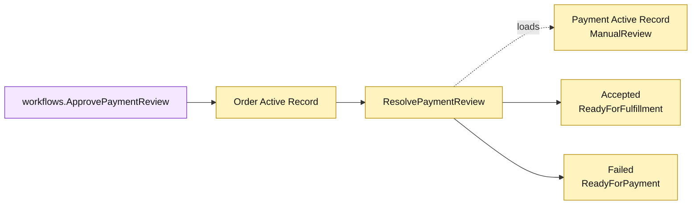

# Lesson 029: Resolve Payment Review

## Objective

Add an Active Record operation that resolves a manually reviewed payment into fulfillment or a retryable payment failure.

## Theory

`CapturePayment` can pause an order in `PaymentReview`, but the pause needs an explicit continuation. `Order.ResolvePaymentReview` will:

1. require a reviewer and the `PaymentReview` order state;
2. load the linked `Payment` Active Record and require `ManualReview`;
3. validate an accept or reject decision;
4. persist reviewer metadata and comment;
5. move accepted orders to `ReadyForFulfillment` or rejected orders to `ReadyForPayment`.

The order method coordinates both persistence-aware records while the workflow remains a small application entry point.

## Why This Matters Here

Active Record can represent an asynchronous-looking pause without events or a separate state-machine object. The tradeoff is visible in repeated status checks and cross-record coordination around `Order`.

## Diagram

Legend:

- purple: application workflow;
- yellow: Active Record state and behavior;
- dashed arrow: payment lookup;
- solid arrows: review results.

## Implementation Focus

Implement only:

- payment review decision values and errors;
- `Order.ResolvePaymentReview`;
- `ApprovePaymentReview` workflow;
- accepted and rejected review tests;
- reviewer, missing-payment, invalid-decision, and wrong-state validation.

Leave partial fulfillment for later lessons.

## What To Verify

- `go test ./...` passes from `active-record-architecture/`;
- manual review can be accepted;
- accepted review makes the order fulfillable;
- rejected review returns the order to payment retry;
- reviewer and decision comment are persisted.
