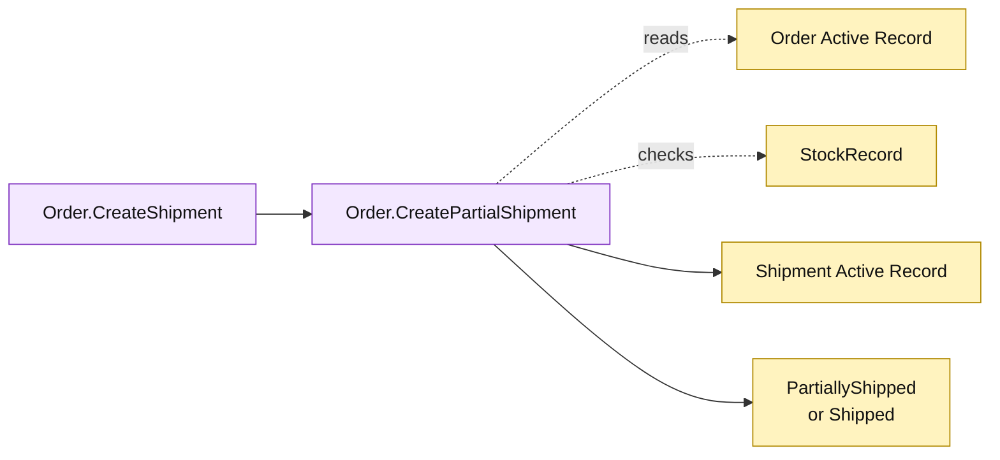

# Lesson 030: Support Partial Shipments

## Objective

Extend shipment processing so a paid order can ship selected quantities while retaining the remaining fulfillment state.

## Theory

The original `Order.CreateShipment` assumed every reserved line shipped together. This lesson adds `Order.CreatePartialShipment`, which:

1. requires a fulfillable order and shipper;
2. derives all remaining lines when no selection is supplied;
3. validates selected line quantities against remaining reservations;
4. creates a shipment for only the selected quantities;
5. consumes the matching stock;
6. sets the order to `PartiallyShipped` or `Shipped` based on what remains.

`CreateShipment` becomes a convenience operation that delegates to the same Active Record behavior.

## Why This Matters Here

The change is small in code but meaningful in the model: line-level bookkeeping now influences aggregate status. Active Record keeps the coordination on `Order`, making the growing fulfillment responsibility easy to see.

## Diagram

Legend:

- purple: Active Record fulfillment operations;
- yellow: persisted records and resulting state;
- dashed arrows: reads and preflight checks;
- solid arrows: shipment and status writes.

## Implementation Focus

Implement only:

- `CreatePartialShipment`;
- line-level quantity validation;
- partial versus complete order status;
- full-shipment delegation through the same model operation;
- tests for partial, complete, and invalid shipments.

Leave partial returns for the next lesson.

## What To Verify

- `go test ./...` passes from `active-record-architecture/`;
- a subset of reserved quantities can be shipped;
- the order becomes `PartiallyShipped` when work remains;
- a later shipment can finish the order;
- stock is consumed only for selected quantities.
