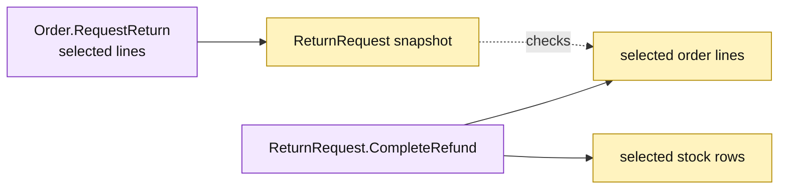

# Lesson 031: Support Partial Returns By Line

## Objective

Make partial return behavior explicit: a request can select quantities from selected order lines without consuming other returnable quantities.

## Theory

`Order.RequestReturn` already matches requested lines against shipped minus returned quantities. This lesson verifies the line-level boundary in the complete Active Record flow:

- explicit line selections are preserved;
- duplicate line entries are rejected before persistence;
- completion updates only selected order lines and stock rows;
- a later request can return the remaining quantity.

The `Order` and `ReturnRequest` records remain responsible for persistence and behavior, while each request carries its own selected line snapshot.

## Why This Matters Here

Partial fulfillment and partial returns make line-level bookkeeping essential. Active Record keeps the arithmetic near the records, but every new reverse command must still understand shipped-minus-returned quantities and related stock effects.

## Diagram

Legend:

- purple: Active Record operations;
- yellow: passive line snapshots and reverse side effects;
- dashed arrow: quantity validation;
- solid arrows: selected-line writes.

## Implementation Focus

Implement only:

- duplicate line detection in `RequestReturn`;
- explicit partial-return tests;
- selective returned-quantity and restock updates;
- a second return over the remaining quantity.

Leave pricing plugins for the next lesson.

## What To Verify

- `go test ./...` passes from `active-record-architecture/`;
- one line can be returned without changing another;
- a later request can return the remaining quantity;
- duplicate line entries are rejected before any return is saved.
