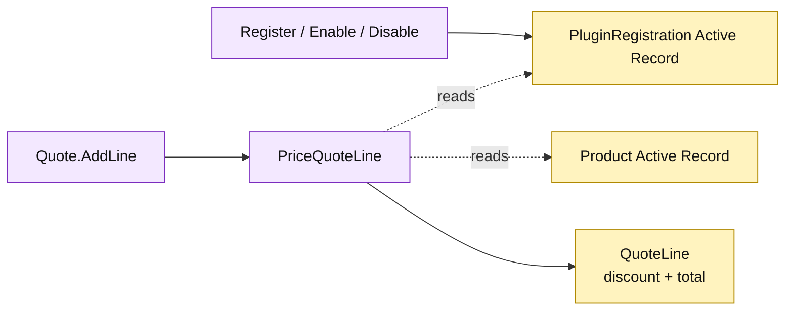

# Lesson 032: Add A Plugin Pricing Extension Point

## Objective

Add a small plugin-registration Active Record and let enabled pricing plugins contribute deterministic quote-line discounts.

## Theory

The application now has replaceable pricing variation. This lesson will:

1. persist plugin registrations and configuration;
2. enable or disable registrations through thin workflows;
3. scan enabled pricing records in deterministic key order;
4. cap the combined discount at 100 percent;
5. make `Quote.AddLine` persist the resulting discount and line total.

The extension point remains procedural and configuration-aware. There is no plugin interface, reflection, dependency-injection container, or generic framework.

## Why This Matters Here

Active Record can host a simple extension point, but the pricing behavior remains coupled to row fields and configuration keys. That is easy to inspect for one plugin type and becomes less attractive as precedence, validation, and third-party ownership multiply.

## Diagram

Legend:

- purple: Active Record workflows and pricing operation;
- yellow: persisted plugin, product, and quote-line data;
- dashed arrows: configuration and product reads;
- solid arrows: registration or quote-line writes.

## Implementation Focus

Implement only:

- passive plugin registration data and persistence;
- `RegisterPlugin`, `EnablePlugin`, and `DisablePlugin` workflows;
- configured pricing-plugin discount calculation;
- `Quote.AddLine` integration and pricing tests;
- deterministic behavior for multiple enabled pricing plugins.

Do not introduce a generic plugin framework or cross-architecture ports.

## What To Verify

- `go test ./...` passes from `active-record-architecture/`;
- an enabled pricing plugin changes line totals;
- disabled plugins have no effect;
- plugin configuration is persisted;
- multiple plugins produce deterministic capped discounts.
