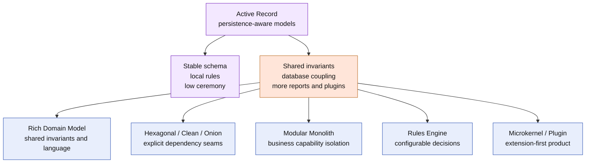

# Lesson 033: Why Not Stop At Active Record?

## Objective

Explain what the completed Active Record track handles well, which pressures are now visible, and why Rich Domain Model is the next architecture in the roadmap.

## Short Answer

You absolutely could stop here for a small or medium system whose workflows are local and whose persistence model is stable.

This track now includes:

- quote creation, editing, approval, rejection, and conversion;
- reservation, payment, review, shipment, cancellation, and returns;
- partial shipment and partial return quantities;
- idempotent return commands;
- query surfaces and read-time reports;
- a configured pricing-plugin extension point.

Active Record made each operation concrete: load a persistence-aware model, invoke its behavior, save it, and let related records save themselves when needed.

The question is not whether Active Record can implement more behavior. It can. The question is whether the next complexity is still easiest to reason about when business behavior and database knowledge live on the same model.

## What Active Record Is Good At

### 1. Local Persistence Clarity

`FindOrder`, `Order.Cancel`, `Order.CreatePartialShipment`, and `ReturnRequest.CompleteRefund` make the read/change/save path easy to trace.

### 2. Low Ceremony

Persistence-aware records, a small database boundary, and thin workflows are enough to express a broad business surface without a large dependency graph.

### 3. Discoverable Behavior

Operations sit beside the fields they change. A developer can find quote editing, payment review, fulfillment, and return behavior without navigating many layers.

### 4. Practical Transaction Coordination

Reservation, payment, shipment, cancellation, refund, and restocking coordination is visible in the model methods. The architecture does not pretend that persistence automatically solves sequencing or consistency.

### 5. A Useful Baseline

The track is a practical comparison point before introducing stronger domain boundaries, richer invariants, or independent read/write models.

## The Pressure We Can See Now

### 1. Models Know Persistence Details

`Order` knows how to load stock, payment, shipment, and database rows. `ReturnRequest` knows refund and inventory persistence. The same model now carries business rules and storage coordination.

### 2. Database Choice Is Part Of The Model Shape

The records hold a database connection and save directly into tables. Replacing the in-memory store with another database, a different schema, or a non-database implementation requires changes near the business behavior rather than only at an outer adapter.

### 3. Shared Invariants Can Drift

Status transitions, quantity arithmetic, eligibility, payment review, shipment selection, and cancellation rules are spread across several Active Records and workflows. The methods help, but callers can still mutate public fields and bypass those methods.

### 4. Multi-Record Consistency Needs More Than Save Methods

Reservation, shipment, return, refund, and plugin pricing operations touch multiple records. A real database still needs transaction boundaries, concurrency control, recovery, and conflict handling beyond the model’s `Save` calls.

### 5. Queries And Reports Scan The Write Model

The query surfaces are deterministic and useful, but reports read the same structures used for commands. Growing history, dashboards, or reporting volume may call for a dedicated read model.

### 6. Extension Logic Remains Configuration-Aware Model Code

The pricing plugin works without a generic framework, but plugin behavior still depends on registration rows and configuration keys. More plugin types, precedence rules, validation, or third-party ownership would push toward a stronger extension boundary.

## What This Does Not Mean

The architecture did not fail because the sample grew. Many real applications intentionally use Active Record for its productivity and directness.

The tradeoff is where complexity lives:

- Active Record keeps persistence and behavior together;
- Rich Domain Model moves shared invariants into richer domain objects;
- Hexagonal, Clean, or Onion styles add explicit dependency seams;
- Modular Monolith organizes complexity around business capabilities;
- Rules Engine externalizes configurable decision logic;
- Microkernel makes extension capability the center of the design.

None is automatically better. Each optimizes for a different pressure.

## Diagram

Legend:

- purple: Active Record strengths and center of gravity;
- orange: pressure revealed by the completed sample;
- blue: possible next architectures, selected by the dominant problem.

## Practical Handoff Questions

Continue comparing architectures when the answer to one of these becomes yes:

- Do several workflows need the same invariant protected from every caller?
- Are public fields or persistence coupling making change risky?
- Do teams need stronger boundaries between quoting, ordering, fulfillment, returns, and plugins?
- Do reports need independent read models or historical projections?
- Do rules need to be configured outside ordinary code changes?
- Are plugins becoming a primary product capability?

For this roadmap, the next experiment is **Rich Domain Model Architecture**, because the completed sample now exposes shared lifecycle and quantity invariants that deserve a stronger domain home.

## Implementation Focus

This closing lesson adds no new business behavior. It records the architectural comparison at the completed state and identifies the next experiment from observed pressure rather than fashion.

## What To Verify

- all lessons `000` through `033` exist in this architecture;
- the final code remains persistence-aware Active Records with thin workflows;
- `go test ./...` passes from `active-record-architecture/`;
- the next architecture is chosen because of concrete complexity pressure, not because Active Record is universally wrong.
