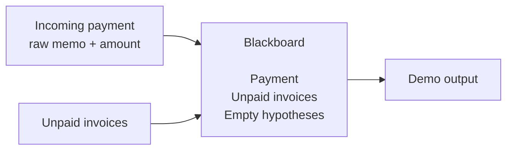

# Lesson 001: The Blackboard Skeleton

## Objective

Introduce the payment-matching scenario and create the smallest useful Blackboard: a shared working memory containing the payment, the unpaid invoices, and one empty hypothesis for each possible invoice.

This lesson deliberately does not match anything yet.

## Theory

In a Blackboard Architecture, different specialists work on a common problem by reading and enriching a shared working memory.

For the payment matcher, the working memory contains three kinds of information:

- the incoming payment, including its unstructured bank memo
- the unpaid invoices that could explain the payment
- candidate hypotheses that will accumulate evidence over time

At this point the Blackboard is only a data structure. That is intentional. We first make the problem state visible; later lessons will add Knowledge Sources that contribute evidence and a Controller that coordinates them.

We represent money as integer cents instead of `float64`. The example is about architecture, but avoiding floating-point money also keeps the model technically sound.

## Why This Matters Here

The original payment memo is ambiguous:

```text
DEP BY A. PAPADOPOULOS REF 1042
```

Two invoices have the same amount, and only one belongs to Papadopoulos. No single fact is enough to explain the payment reliably. That makes the scenario a good fit for several independent specialists contributing partial evidence to the same Blackboard.

The first step is to preserve all the facts those specialists will need without making any matcher responsible for the whole workflow.

## Diagram



There are no Knowledge Sources in this lesson yet. The Blackboard is the central state that future specialists will inspect and enrich.

## Implementation Focus

Implement:

- `Invoice`, `Payment`, and `MatchHypothesis` data types
- a `Blackboard` containing the payment, invoices, and candidate hypotheses
- `NewBlackboard`, which creates one zero-score hypothesis per invoice
- a small console demo that prints the initial state

Deliberately leave these for later lessons:

- score updates and matching rules
- the `KnowledgeSource` interface
- the Controller
- concurrency and synchronization

## What To Verify

From the `blackboard-architecture` folder, run:

```text
go run ./cmd/matcher-demo
```

The output should show the payment, all three unpaid invoices, and an initial score of `0.0` for every candidate. No invoice should be declared a match yet.
