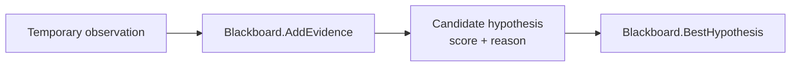

# Lesson 002: Evidence Accumulates on the Blackboard

## Objective

Turn the Blackboard from a passive input container into working memory that can accumulate evidence and identify the strongest current hypothesis.

## Theory

A Blackboard is useful because specialists do not need to produce a final decision independently. Each specialist can contribute a small piece of evidence to a shared candidate.

The Blackboard therefore owns two simple operations:

- add points and a human-readable reason to a candidate
- find the candidate with the highest current score

The score is capped at `1.0`, so a later specialist cannot make confidence exceed the scale used by the example. The reasons remain on the hypothesis because a matching system should be able to explain its decision, not only return a number.

We still do not have a `KnowledgeSource` interface. The demo temporarily adds one observation directly so that the state transition is visible before we introduce the objects that will produce it.

## Why This Matters Here

The amount, reference, and customer name are independent clues. None of them should replace the others or decide the whole problem alone. They should contribute evidence to the same candidate on the Blackboard.

That gives us a useful separation:

- evidence producers will be added later
- evidence aggregation belongs to the Blackboard
- choosing the best current hypothesis can be shared by the Controller

## Diagram



The temporary observation is deliberately not a real matcher yet. It will be replaced by a Knowledge Source in the next lesson.

## Implementation Focus

Implement:

- `Blackboard.AddEvidence`
- score capping at `1.0`
- `Blackboard.BestHypothesis`
- a demo that adds one amount observation to `INV-102`

Deliberately leave these for later lessons:

- the `KnowledgeSource` interface
- real matching rules
- source registration and Controller orchestration
- concurrent access protection

## What To Verify

From the `blackboard-architecture` folder, run:

```text
go run ./cmd/matcher-demo
```

The output should show that `INV-102` has received a score and a reason, and that it is currently the best hypothesis. The demo is still using only one manually supplied observation.
