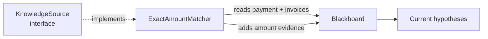

# Lesson 003: The First Knowledge Source

## Objective

Replace the temporary manual observation with a real Knowledge Source and make the extension contract explicit.

## Theory

A Knowledge Source is a specialist that knows how to recognize one kind of evidence. It reads the current Blackboard state and contributes only the evidence it understands.

The `KnowledgeSource` interface gives every specialist the same small contract:

- a name for diagnostics
- an `Execute` operation that receives the Blackboard

The specialist does not return a final invoice. It writes evidence to the Blackboard. This keeps the specialist focused on one rule and leaves combination of evidence to the shared working memory.

## Why This Matters Here

Exact amount matching is useful, but it is not enough for this scenario: both `INV-102` and `INV-103` are for `450.00`.

That limitation is valuable. It shows why the architecture needs multiple independent specialists instead of one large `FindMatchingInvoice` function. The first specialist can be incomplete and still be useful because later specialists will add more evidence to the same hypotheses.

## Diagram



The dashed relationship is the implementation contract. The solid arrows are the runtime interaction with the Blackboard.

## Implementation Focus

Implement:

- the `KnowledgeSource` interface
- `ExactAmountMatcher`
- execution of one registered-in-code source
- output that shows both invoices with the exact amount received evidence

Deliberately leave these for later lessons:

- additional matching strategies
- a Controller that owns source orchestration
- parallel execution

## What To Verify

From the `blackboard-architecture` folder, run:

```text
go run ./cmd/matcher-demo
```

Both `INV-102` and `INV-103` should receive `+0.4`. The result should remain ambiguous, demonstrating that one Knowledge Source cannot solve the whole problem.
