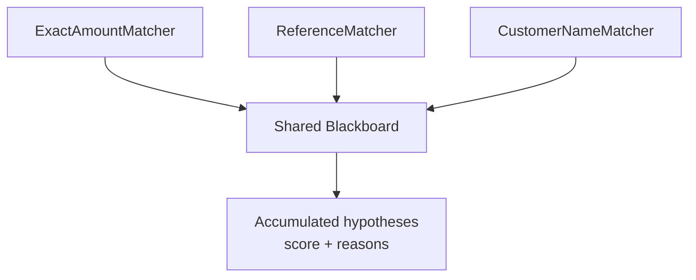

# Lesson 004: Independent Matchers, Shared Evidence

## Objective

Add two more Knowledge Sources and let several independent rules contribute evidence to the same hypotheses.

## Theory

The Blackboard does not require every Knowledge Source to understand every clue. Each source can specialize in one recognition strategy:

- exact amount
- invoice reference in the memo
- customer surname in the memo

The sources are deliberately unaware of one another. They do not call each other, and they do not need to know how the final decision will be made. Their only collaboration mechanism is the Blackboard.

A source may also contribute nothing. That is still useful: the absence of an invoice reference should not prevent the amount and name specialists from doing their work.

## Why This Matters Here

The exact amount matcher alone leaves `INV-102` and `INV-103` tied at `0.4`. The customer name matcher adds evidence only to `INV-102`, making the combined result distinguishable.

This is the non-trivial part of the example. No single rule is the complete solution; the answer emerges from accumulated partial observations.

The loop in `main` is intentionally temporary orchestration. It makes the next design pressure visible: source execution should not be owned by the demo entry point.

## Diagram



The sources are peers. None of them is the parent of another source, and none produces the final answer directly.

## Implementation Focus

Implement:

- `ReferenceMatcher`
- `CustomerNameMatcher`
- execution of all three sources through the existing interface
- evidence and reason output for the resulting candidates

Deliberately leave these for the next lesson:

- a dedicated Controller
- confidence thresholds and early stopping
- parallel execution

## What To Verify

From the `blackboard-architecture` folder, run:

```text
go run ./cmd/matcher-demo
```

The expected result is approximately:

- `INV-102`: `0.7` from amount plus customer surname
- `INV-103`: `0.4` from amount only

The reference source may remain silent for the current memo because it contains no invoice ID. That is expected.
