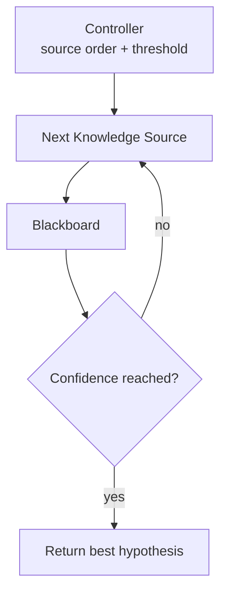

# Lesson 005: Controller and Opportunistic Convergence

## Objective

Move source orchestration out of `main` and introduce a Controller that can stop when the Blackboard contains enough evidence.

## Theory

The Controller is the active part of a Blackboard Architecture. It decides which Knowledge Sources to run and when the current state is good enough to stop.

For this small example, the policy is intentionally simple:

1. execute registered sources in their registration order
2. inspect the best current hypothesis
3. stop when its score reaches the confidence threshold

This is opportunistic reasoning in miniature. The Controller does not wait for a fixed business procedure to finish if the shared state has already converged.

The tradeoff is visible too: source ordering is now a scheduling decision. A stronger implementation could use priorities or activation conditions, but the simple loop is enough to make the boundary concrete.

## Why This Matters Here

Before this lesson, `main` knew how sources were stored and executed. Adding a fourth matcher would require editing that orchestration code.

After this lesson, `main` only registers Knowledge Sources and asks the Controller to run them. The Controller owns the execution policy, while each source remains focused on its own evidence rule.

With the current ambiguous memo, the amount and surname evidence eventually produce `0.7`. If the memo is changed to include `INV-102`, the reference and amount sources can reach `0.9` and the Controller can skip the remaining source.

## Diagram



The loop is sequential in this lesson so the decision point is easy to observe. Parallel execution is deliberately postponed.

## Implementation Focus

Implement:

- `Blackboard.HasConverged`
- `Controller` source registration
- sequential Controller execution
- a configurable confidence threshold
- a result that reports the best hypothesis and whether convergence was reached

Deliberately leave these for the next lesson:

- goroutines and `sync.WaitGroup`
- mutex-protected Blackboard updates
- race-detector verification

## What To Verify

From the `blackboard-architecture` folder, run:

```text
go run ./cmd/matcher-demo
```

The current memo should converge at `0.7`. Then add `INV-102` to the memo and run again: the Controller should reach the threshold earlier and skip the later source in its registration order.
