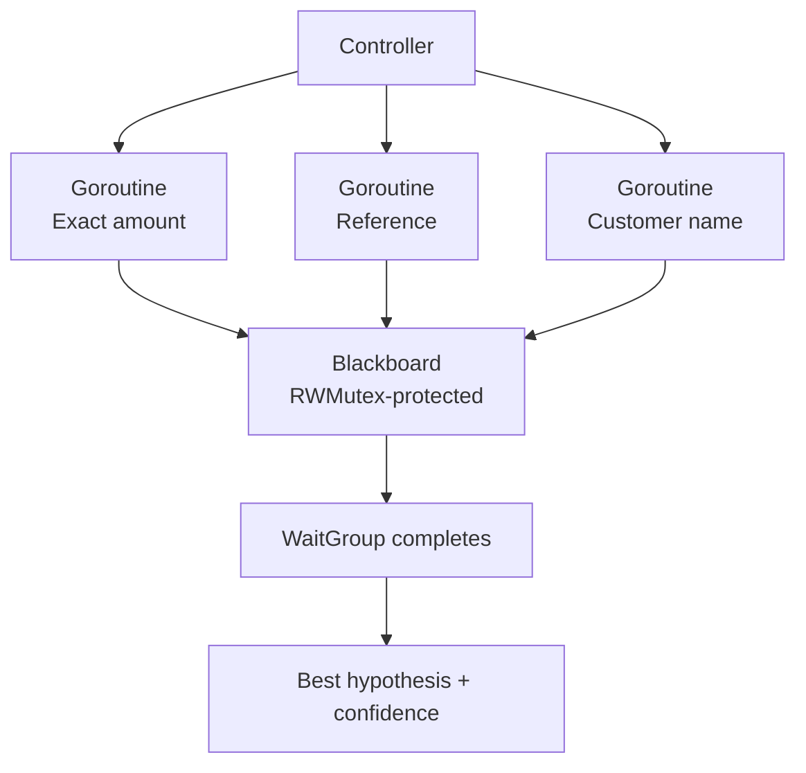

# Lesson 006: Concurrent Knowledge Sources

## Objective

Run independent Knowledge Sources concurrently and make the Blackboard safe for their shared updates.

## Theory

The matching rules do not depend on one another. That makes them good candidates for concurrent execution: the amount, reference, and customer-name specialists can inspect the same payment at the same time.

Concurrency is an implementation choice, not the definition of Blackboard Architecture. The architectural idea is still the shared working memory and the independent specialists. Go makes one implementation of that idea compact with:

- `sync.RWMutex` around Blackboard state
- `sync.WaitGroup` for waiting on all active sources
- goroutines for the independent evaluations

The Controller waits before reading the final result, so the decision is made only after every concurrently started source has finished.

## Why This Matters Here

The Blackboard is now genuinely shared mutable state. Without synchronization, two matchers updating different candidates—or even the same candidate—could race while modifying the hypotheses map and reason slices.

The concurrency version also exposes an important tradeoff:

- sequential execution can stop as soon as confidence converges
- concurrent execution may do extra work because already-started specialists cannot be cancelled by a later score update

The final code keeps both Controller modes visible so the tradeoff is part of the tutorial rather than hidden.

## Diagram



The lock protects writes and snapshots of shared state. The sources themselves remain independent and do not call one another.

## Implementation Focus

Implement:

- `sync.RWMutex` protection for Blackboard operations
- safe input and hypothesis snapshots for Knowledge Sources and the demo
- `Controller.RunConcurrent`
- a focused test that verifies the concurrent result
- race-detector verification

The sequential `Controller.Run` remains available to demonstrate early convergence. The concurrent path deliberately waits for all registered sources.

## What To Verify

From the `blackboard-architecture` folder, run:

```text
go test -race ./...
go run ./cmd/matcher-demo
```

The test should pass without race reports and the demo should still select `INV-102` with a score of `0.7`. The order of the printed reasons may vary because the Knowledge Sources finish independently.

As an extension exercise, add a `DateProximityMatcher` that implements `KnowledgeSource`. The Controller does not need to change; only the source registration needs a new entry.
