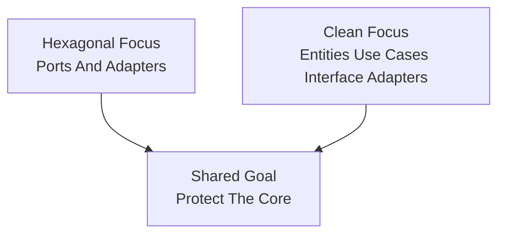

# Lesson 000: From Hexagonal To Clean

## Objective

Explain how Clean Architecture relates to Hexagonal Architecture, where they overlap, where they differ, and why a student might still learn something new by moving from one to the other.

## Short Answer

Clean Architecture and Hexagonal Architecture are close relatives.

They both care deeply about:

- keeping business rules away from frameworks
- inverting dependencies inward
- isolating infrastructure behind boundaries
- making the core testable

So yes, part of the difference is semantic.

But it is not only semantic.

Hexagonal Architecture mainly teaches:

- inside versus outside
- ports versus adapters
- replaceable integrations

Clean Architecture adds a stronger internal map inside the application core:

- entities
- use cases / interactors
- interface adapters
- frameworks and drivers

That extra structure changes how you talk about responsibilities and where you expect data transformations to happen.

## How They Are Related

Both architectures are trying to solve the same broad problem:

"How do we stop delivery mechanisms and infrastructure choices from owning the business application?"

That is why the code will still feel familiar.

In both styles, we want:

- business rules to survive framework changes
- tests to run without real databases or HTTP servers
- adapters to depend on the core, not the other way around

If someone learns Hexagonal first, Clean should not feel like a total reset.

It should feel like a refinement of the same family of ideas.

## Diagram

## What Is Different

The biggest difference is emphasis.

Hexagonal Architecture emphasizes boundary direction:

- the core defines ports
- adapters plug into those ports
- technologies stay outside

Clean Architecture emphasizes concentric policy layers:

- entities hold enterprise-wide rules
- use cases coordinate application-specific rules
- interface adapters translate between outside formats and use-case formats
- frameworks sit at the edge

In practice, that means Clean Architecture usually makes these distinctions more explicit:

- controller versus use case
- use case input model versus entity
- presenter versus response model
- interface adapter versus framework code

Hexagonal can express those same ideas, but it does not force that vocabulary as strongly.

## Is The Difference Mostly Semantic?

Partly, yes.

If you implement Hexagonal carefully, you can end up with code that looks very close to Clean.

If you implement Clean lightly, it can resemble Hexagonal with slightly different folder names.

But the difference is not just naming.

Clean Architecture gives stronger guidance about the inside of the core:

- what counts as an entity
- what counts as a use case
- where mapping should happen
- why controllers and presenters are not the same thing as business logic

Hexagonal Architecture is often more flexible about those details.

That flexibility is useful, but it can also leave more room for uneven internal structure.

## What Clean Solves Better In This Comparison

Clean Architecture helps more when the question becomes:

"Now that the outside world is isolated, how should the inside be organized?"

That gives it a few teaching advantages over the Hexagonal track.

### 1. Use-Case Boundaries Become More Explicit

In Hexagonal, use cases were explicit, but presenters and request/response models were lighter.

In Clean, we can show more clearly:

- who receives input
- who coordinates the use case
- who prepares output for a UI

### 2. Data Shape Translation Gets A Clearer Home

Clean gives a stronger answer to:

"Where should transport-shaped data stop and application-shaped data begin?"

The answer is usually:

- controllers translate incoming requests into use-case input models
- presenters translate use-case output into view models

### 3. The Internal Policy Hierarchy Is Easier To Teach

The distinction between:

- entities
- use cases
- interface adapters

is one of the main teaching strengths of Clean Architecture.

Hexagonal does not always make that internal ladder as visible.

## What Hexagonal Solves Better Or More Naturally

Hexagonal Architecture is often simpler to explain when the main concern is integration boundaries.

It gives a compact mental model:

- core inside
- adapters outside
- ports between them

That can be more direct than teaching circles plus controllers plus presenters plus gateways all at once.

Hexagonal also often feels more natural when you want to emphasize:

- replaceable external systems
- inbound versus outbound adapter variety
- technology isolation as the main design pressure

So if the main pain is integration sprawl, Hexagonal often gets you to the point faster.

## Questions A Student Might Naturally Ask

### "Did we just rename ports?"

Not exactly.

Some Clean interfaces play a similar role to ports, especially gateways and boundaries.

But Clean also adds stronger distinctions between:

- use-case input boundary
- use-case output boundary
- controller
- presenter
- entity

That is more than a rename.

### "Will the code become more verbose?"

Usually yes.

That is one of the tradeoffs.

Clean Architecture often introduces:

- more DTOs
- more mapping steps
- more small interfaces

The point is not fewer files.

The point is more explicit responsibility boundaries.

### "If Hexagonal already worked, why continue?"

Because Hexagonal mostly solved the outside-boundary problem.

Clean is useful when you want to study the inside-boundary problem more carefully.

### "Are these architectures compatible?"

Yes.

Many real systems are best described as a blend of:

- hexagonal at the integration boundary
- clean in the application core

The labels overlap in practice.

For this repository, the goal is not to police terminology.

The goal is to make the emphasis of each style visible.

## What Will Change In The Upcoming Clean Lessons

Compared with the Hexagonal track, expect the Clean track to make these elements more visible from the start:

- entities as the inner policy layer
- use-case interactors as application-specific orchestration
- request and response models
- output boundaries and presenters
- interface adapters as translators rather than business owners

The business workflows will stay familiar.

The architectural lesson will be about where translation and policy responsibility live.

## Summary

Hexagonal and Clean are close enough that moving from one to the other should feel evolutionary, not revolutionary.

The shared core lesson is:

- protect the business application from outside technologies

The main difference is emphasis:

- Hexagonal is stronger as a ports-and-adapters boundary story
- Clean is stronger as an internal policy-layer story

So this track is worth doing not because Hexagonal was insufficient, but because Clean makes a different architectural question easier to see:

"Once dependencies point inward, how should the inside itself be organized?"
