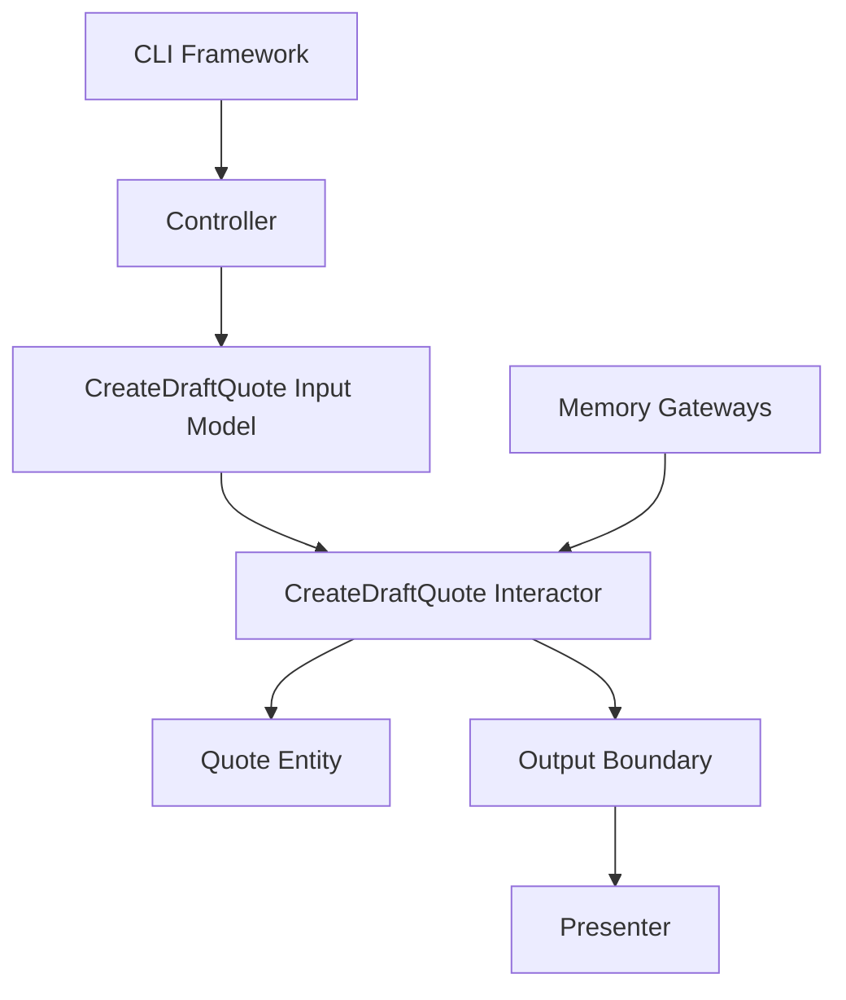
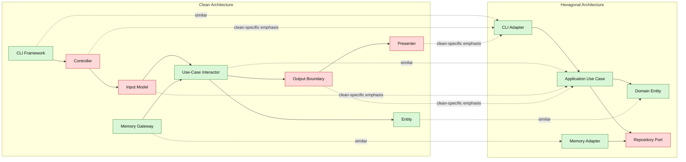

# Lesson 001: Clean Architecture Skeleton

## Objective

Build the first runnable slice of the application in Clean Architecture and make the dependency rule visible through entities, a use-case interactor, interface adapters, and outer infrastructure.

## Theory

Clean Architecture organizes the system into policy layers.

The core idea is not only that dependencies should point inward.

It is also that different kinds of responsibility should be separated clearly:

- entities hold core business concepts and rules
- use cases coordinate application-specific behavior
- interface adapters translate between outside input/output and use-case models
- frameworks and infrastructure stay at the edge

This solves a problem that can still remain after Hexagonal Architecture:

- the outside boundary is protected
- but the inside can still become structurally vague

Clean Architecture gives stronger names and expectations for that internal shape.

The tradeoff is more indirection and more translation code, even for small flows.

## Why This Matters Here

For this repository, the first Clean lesson should not try to prove everything at once.

It should make one thing unmistakable:

- business entities are not controllers
- use cases are not presenters
- storage is not the use case
- the outer layers depend inward

## Diagram

## Clean Vs Hexagonal View

The current Clean diagram has a close Hexagonal relative.

The green nodes below represent responsibilities that are broadly similar between the two styles.

The red nodes represent places where Clean Architecture usually makes a stronger distinction than Hexagonal does in its simplest form.

## Similarities And Differences

Similar structure:

- both keep the business core away from framework and storage details
- both make dependencies point inward
- both allow the outer storage implementation to be replaced
- both make the quote creation flow testable without real infrastructure

Different emphasis:

- Hexagonal talks first about ports and adapters
- Clean talks first about entities, use cases, and interface adapters
- Clean usually makes controller and presenter roles explicit earlier
- Clean usually introduces request and response models earlier
- in this Clean variant, the use case owns the small gateway and boundary interfaces it needs, instead of depending on a broader shared `ports` package
- that usually leads to narrower contracts per use case and makes interface segregation more visible
- Hexagonal often leaves those translation steps lighter or implicit in early lessons

Another useful way to say the difference is this:

- in the Hexagonal track, ports were presented as a shared boundary language for the core
- in this Clean track, the use case is allowed to define the exact boundary shape it needs

That is not automatically better in every codebase, but it does highlight an important Clean Architecture habit:

- dependencies should point inward
- and the inward dependency should be as small as the specific policy needs

So your observation is right:

- this structure can support the Interface Segregation Principle more directly because each use case can depend on a minimal gateway or boundary instead of a larger general-purpose contract

## Implementation Focus

Implement one simple flow:

- create a draft quote

The code should show:

- an entity `Quote`
- an entity `Customer`
- a `CreateDraftQuote` interactor
- request and response models
- a controller adapter
- a presenter adapter
- in-memory gateways
- a small CLI demo that wires the slice together

Do not add quote lines, HTTP, approval, or inventory yet.

## What To Verify

- the project compiles
- `go test ./...` passes
- the demo can create a draft quote
- dependency direction is visible from the folder structure and constructor wiring
