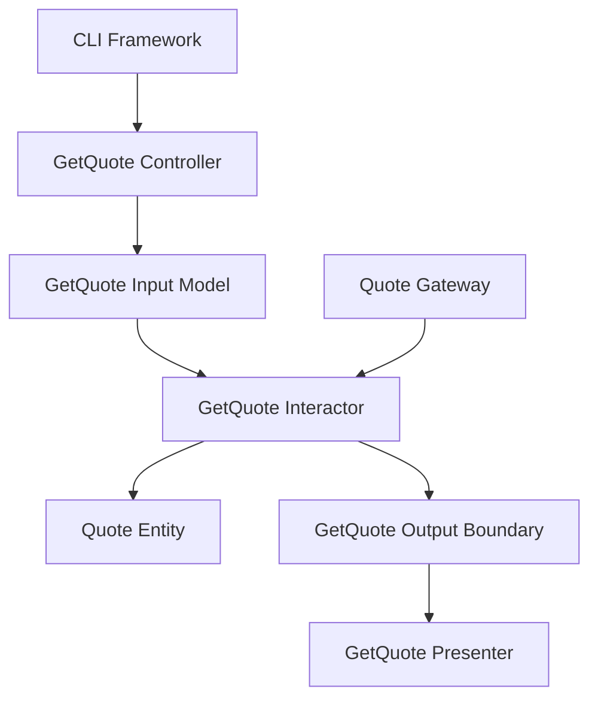

# Lesson 002: Query Use Case And Presenter

## Objective

Add the first read-side use case and show that query flows in Clean Architecture still pass through a controller, an interactor, and a presenter rather than reading infrastructure models directly.

## Theory

After the first write path, an easy mistake is to think reads are simpler and can bypass the architectural boundaries.

Clean Architecture pushes against that shortcut.

Even a query still has distinct responsibilities:

- a controller accepts the outside request shape
- a use case defines what information the application wants
- a gateway retrieves entities
- a presenter prepares the response shape for the outside world

This solves a common drift:

- writes stay carefully structured
- reads slowly become direct repository access from outer layers

That drift makes the architecture inconsistent and lets storage concerns leak outward.

The tradeoff is the same as before:

- more mapping
- more small types
- more ceremony for even a simple query

## Why This Matters Here

The first lesson proved the basic dependency rule.

This lesson proves that Clean Architecture is not only for commands.

If reads bypass the interactor and presenter, then the code quickly stops teaching the architecture clearly.

## Diagram

## Implementation Focus

Implement one simple read flow:

- get quote by id

The code should show:

- a `GetQuote` interactor
- a gateway operation for loading a quote
- a query controller
- a query presenter
- the CLI demo using both create and get flows

Do not add HTTP, quote lines, approval, or list queries yet.

## What To Verify

- the project compiles
- `go test ./...` passes
- the demo can create a draft quote and then load it again
- the query path still respects inward dependency direction
