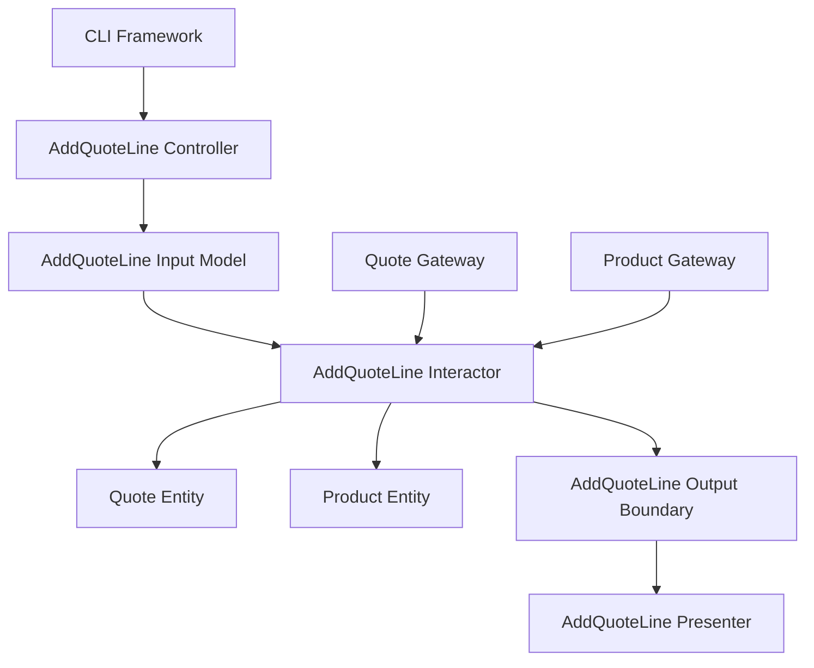

# Lesson 003: Add Quote Line With Gateways

## Objective

Introduce the first use case that coordinates multiple gateways and mutates an existing entity, so the Clean Architecture flow starts showing application orchestration instead of only simple create/get cases.

## Theory

The earlier lessons proved the structural skeleton:

- a controller calls an interactor
- an interactor uses entities and gateways
- a presenter prepares the result

Now we need a use case with more realistic pressure.

Adding a quote line is useful because the interactor must:

- load the existing quote
- load the product
- apply entity rules
- save the updated quote
- present the updated result

This is where Clean Architecture becomes easier to recognize as more than folder organization.

The use case is not a repository call.

It is application-specific coordination around entities and boundaries.

The tradeoff is visible too:

- more types
- more request/response models
- more gateway seams

But that extra structure makes the orchestration responsibility easier to locate.

## Why This Matters Here

In this repository, later lessons will involve pricing, approval, inventory, and payment boundaries.

Before that, we need one smaller example that already shows:

- use cases can depend on several narrow interfaces
- entity behavior can stay inside the entity
- the presenter still owns outward formatting

## Diagram

## Implementation Focus

Implement one use case:

- add a line to a draft quote

The code should show:

- a `Product` entity
- quote line state on the `Quote` entity
- entity validation for editable quote state and positive quantity
- a product lookup gateway
- an `AddQuoteLine` interactor
- a controller and presenter for the new use case
- the CLI demo creating a quote, adding a line, and then loading it

Do not add pricing policies, approval, or HTTP yet.

## What To Verify

- the project compiles
- `go test ./...` passes
- the demo can add a line to a draft quote
- the interactor depends only on the exact gateway operations it needs
