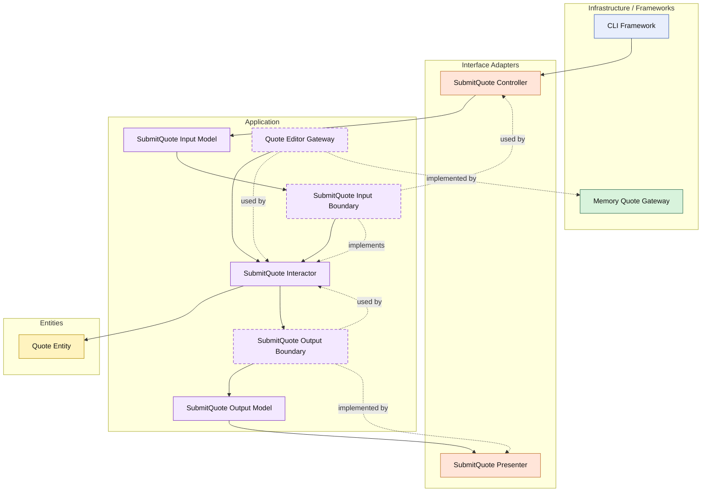

# Lesson 004: Submit Quote State Transition

## Objective

Introduce the first explicit lifecycle transition on the `Quote` entity and show how a Clean Architecture interactor coordinates that transition without owning the business rule itself.

## Theory

By this point, the Clean structure is visible, but the entity is still mostly a data holder plus line-editing behavior.

We now need a rule that is clearly about business state, not just data lookup.

Submitting a quote is a good first transition because it answers a real business question:

- when is a draft quote allowed to move forward?

That rule belongs on the entity because it is about the quote's own lifecycle and invariants.

The interactor still matters, but for a different reason:

- load the quote
- ask the entity to transition
- save the updated entity
- present the result

This is one of the key Clean lessons:

- use cases coordinate application flow
- entities own their own business state rules

The tradeoff is that even a simple status change still involves several small types and layers.

## Why This Matters Here

Later lessons will need quote status to matter for approval, conversion, and downstream workflows.

Before introducing those extra boundaries, we need one clean example of:

- entity-owned lifecycle rules
- interactor-owned orchestration
- presenter-owned outward formatting

## Diagram

Legend:

- blue: framework edge
- green: data adapter
- orange: functionality / translation adapter
- purple: application use case
- yellow: entity layer
- dashed border: interface / contract
- dashed arrow: implementation relationship

Layering view:

- `Entities` contain core business rules
- `Application` owns the use-case contracts and coordinates the use case
- `Interface Adapters` translate between outside shapes and application-owned models
- `Infrastructure / Frameworks` hold technical delivery and persistence details

## Implementation Focus

Implement one use case:

- submit a draft quote

The code should show:

- a new quote status for submitted state
- entity validation that a quote cannot be submitted without lines
- entity validation that only a draft quote can be submitted
- a `SubmitQuote` interactor
- a controller and presenter for the transition
- the CLI demo creating, editing, submitting, and then loading the quote

Do not add approval policies or order conversion yet.

## What To Verify

- the project compiles
- `go test ./...` passes
- the demo can submit a quote after adding a line
- the lifecycle rule is visible on the entity, not buried in the interactor
