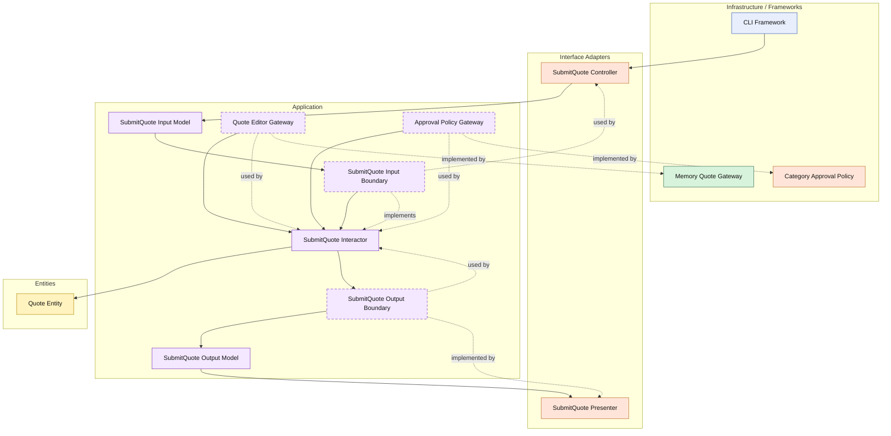

# Lesson 005: Approval Policy Boundary

## Objective

Introduce the first external rule boundary in the Clean Architecture track by making quote submission depend on an approval policy contract instead of hard-coding that decision inside the interactor.

## Theory

Not every business rule belongs in the entity itself.

Some rules depend on policy choices that may vary by organization, product type, or integration behavior.

In this case, the `Quote` entity should still own its own lifecycle constraints:

- only a draft quote can be submitted
- a quote cannot be submitted without lines

But the decision:

- does this quote need approval first?

is a separate policy question.

That makes it a good boundary for the application layer to depend on through a contract.

So the responsibility split becomes:

- the entity enforces its internal transition invariants
- the use case orchestrates the submission flow
- the approval policy tells the use case whether the submitted quote becomes `Approved` or `PendingApproval`

This is useful because it keeps the interactor from becoming a bag of embedded policy conditions and makes the rule replaceable without changing the application flow.

The tradeoff is another interface and another adapter to wire.

## Why This Matters Here

Later lessons will need more external business rules:

- pricing
- inventory
- payment
- returns

Before adding those, we need one clear example of a policy seam that is neither:

- just entity state logic
- nor just persistence

Approval is a good first example.

## Diagram

Legend:

- blue: framework edge
- green: data adapter
- orange: functionality / policy / translation adapter
- purple: application layer
- yellow: entity layer
- dashed border: interface / contract
- dashed arrow: structural relationship

## Implementation Focus

Extend one existing use case:

- submit a draft quote through an approval policy

The code should show:

- a new `PendingApproval` status
- a new `Approved` status
- an approval policy contract owned by the application layer
- a concrete policy adapter that requires approval for `CustomBuild` products
- submission resulting in either `Approved` or `PendingApproval`

Do not add separate manual approval commands yet.

## What To Verify

- the project compiles
- `go test ./...` passes
- submitting a standard quote becomes `Approved`
- submitting a `CustomBuild` quote becomes `PendingApproval`
