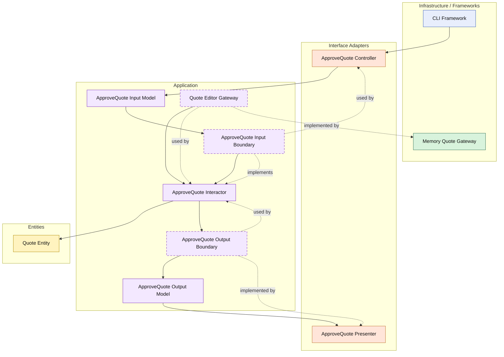

# Lesson 006: Approve Pending Quote

## Objective

Add the explicit approval action that moves a quote from `PendingApproval` to `Approved`, so the Clean Architecture track now distinguishes between:

- the policy that decides whether approval is needed
- the separate use case that actually performs approval

## Theory

The previous lesson introduced an approval policy boundary.

That solved one problem:

- who decides whether submission goes straight through or enters review?

But it did not yet solve the second problem:

- once a quote is waiting for review, who approves it?

That must be a separate use case.

Why?

Because "requires approval" and "approve now" are different business actions with different responsibilities.

The approval policy is a rule input into submission.

The approval use case is an explicit application action over an existing entity state.

So the responsibility split becomes clearer:

- the approval policy helps decide submission outcome
- the `Quote` entity enforces whether approval is valid from its current state
- the approval interactor loads, approves, saves, and presents

This is a useful Clean Architecture lesson because it shows that not every new rule means a new infrastructure dependency. Sometimes the new step is simply a new use case over the same entity and gateway boundary.

## Why This Matters Here

Without this lesson, the `PendingApproval` state exists but is incomplete.

The architecture would be teaching:

- how to enter a review state

but not:

- how to leave it

That would leave the workflow half-modeled.

This lesson completes the approval queue transition while keeping the entity rule and application orchestration separate.

## Diagram

Legend:

- blue: framework edge
- green: data adapter
- orange: functionality / translation adapter
- purple: application layer
- yellow: entity layer
- dashed border: interface / contract
- dashed arrow: structural relationship

## Implementation Focus

Implement one use case:

- approve a pending quote

The code should show:

- entity validation that only `PendingApproval` quotes can be approved
- a dedicated `ApproveQuote` interactor
- a controller and presenter for the approval action
- the CLI demo still showing the ordinary approve-less path
- tests covering both valid and invalid approval transitions

Do not add rejection, actors, or audit metadata yet.

## What To Verify

- the project compiles
- `go test ./...` passes
- a `PendingApproval` quote can become `Approved`
- an already approved quote cannot be approved again
