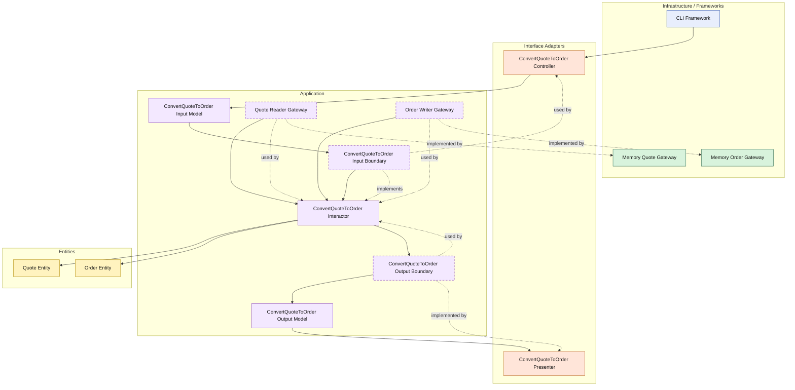

# Lesson 007: Convert Quote To Order

## Objective

Add the first cross-entity workflow in the Clean Architecture track by converting an approved quote into an order through a dedicated use case.

## Theory

Until now, every lesson has stayed inside the quote workflow.

That has been useful for making boundaries visible, but it does not yet show how Clean Architecture handles a workflow that spans two business concepts.

Converting a quote to an order is the first good example.

The use case must:

- load the quote
- verify the quote is in a convertible state
- create an order entity from the quote data
- save the new order

This is where the value of the application layer becomes more concrete.

The interactor is not just calling one repository method.

It is coordinating a business workflow across boundaries while leaving entity-specific rules inside the entities themselves.

The tradeoff is more gateways, more models, and more orchestration code in the use case layer.

## Why This Matters Here

The sample application is not only about quote management.

It eventually needs:

- orders
- payment
- shipment
- returns

Before reaching those later workflows, the architecture needs one clean example of crossing from one aggregate or entity concept into another.

Quote-to-order conversion is the natural next step.

## Diagram

Legend:

- blue: framework edge
- green: data adapter
- orange: functionality / translation adapter
- purple: application layer
- yellow: entity layer
- dashed border: interface / contract
- dashed arrow: structural relationship

## Implementation Focus

Implement one use case:

- convert an approved quote into an order

The code should show:

- an `Order` entity
- entity validation that only approved quotes can be converted
- an order gateway contract and in-memory adapter
- a `ConvertQuoteToOrder` interactor
- a controller and presenter for the new workflow
- the CLI demo creating, editing, submitting, and converting a quote

Do not add inventory reservation or payment yet.

## What To Verify

- the project compiles
- `go test ./...` passes
- an approved quote can become an order
- a non-approved quote cannot be converted
