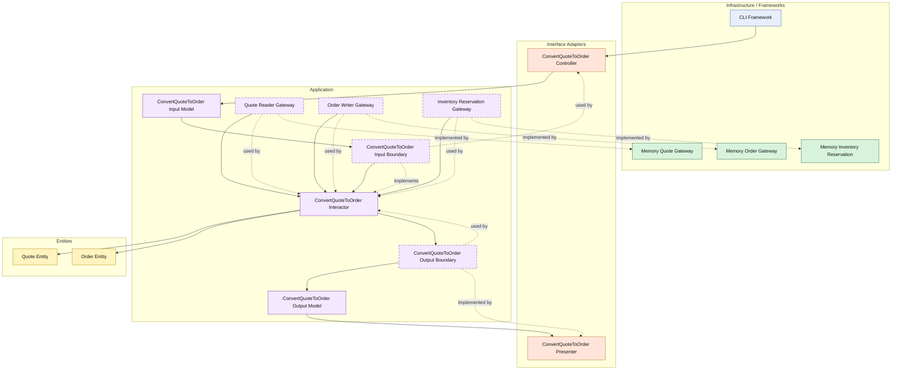

# Lesson 008: Order Conversion With Reservation

## Objective

Extend quote-to-order conversion with an inventory reservation boundary, so the Clean Architecture track now shows a use case coordinating both persistence and an external operational side effect.

## Theory

The previous lesson converted an approved quote into an order, but the workflow was still incomplete.

In a realistic sales flow, conversion usually means more than:

- load quote
- create order
- save order

It also means claiming stock for the ordered items.

That is a good Clean Architecture lesson because reservation is not just another repository write.

It is an external operational boundary with its own contract and failure mode.

So the use case now has to coordinate:

- quote loading
- order creation
- inventory reservation
- order persistence

This makes the application layer more meaningful:

- the entity still owns quote convertibility
- the inventory contract stays outside the entity
- the interactor owns the workflow sequencing across boundaries

The tradeoff is more orchestration and another dependency to wire and test.

## Why This Matters Here

This is the first time the Clean track has to deal with a side effect that is neither:

- purely entity state logic
- nor just saving another record

That makes it an important step before later payment and shipment workflows.

It shows how Clean Architecture handles infrastructure-like operations without letting them leak directly into the entities.

## Diagram

Legend:

- blue: framework edge
- green: data adapter
- orange: functionality / translation adapter
- purple: application layer
- yellow: entity layer
- dashed border: interface / contract
- dashed arrow: structural relationship

## Implementation Focus

Extend one existing use case:

- convert an approved quote into an order and reserve stock

The code should show:

- an inventory reservation contract owned by the application layer
- reservation requests derived from the order lines
- conversion failing when reservation fails
- the in-memory inventory adapter tracking available stock
- the CLI demo reserving stock during conversion

Do not add payment or shipment yet.

## What To Verify

- the project compiles
- `go test ./...` passes
- conversion reserves stock and saves the order
- conversion fails when stock is insufficient
