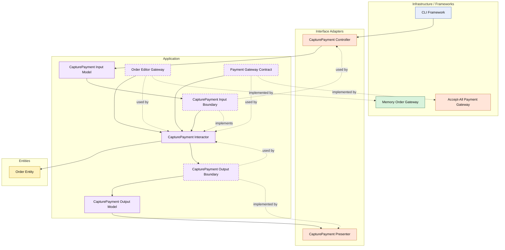

# Lesson 009: Payment Gateway And Order Capture

## Objective

Add payment capture to the order workflow, so the Clean Architecture track now shows an order-side use case that depends on a business integration gateway rather than only repositories and inventory operations.

## Theory

After reservation, the next natural business step is payment.

This introduces a different kind of external boundary.

Inventory reservation is operational and quantity-based.

Payment capture is a business decision boundary:

- the application requests payment capture
- an external gateway answers whether payment succeeded
- the order lifecycle changes based on that outcome

That makes payment a good Clean Architecture example because the use case now coordinates:

- loading the order
- calling an external gateway contract
- asking the entity to transition to a paid state
- saving the updated order

The key responsibility split is:

- the gateway decides payment success or failure
- the entity decides whether its own status may advance
- the interactor sequences the overall workflow

The tradeoff is one more contract, one more adapter, and another application-level orchestration step.

## Why This Matters Here

This lesson matters because order workflows are now starting to leave the quote-centric part of the sample app.

It also sets up the next lesson naturally:

- shipment should not happen before payment

So before adding shipment, the payment boundary needs to exist clearly on its own.

## Diagram

Legend:

- blue: framework edge
- green: data adapter
- orange: functionality / policy / translation adapter
- purple: application layer
- yellow: entity layer
- dashed border: interface / contract
- dashed arrow: structural relationship

## Implementation Focus

Implement one use case:

- capture payment for an order waiting for payment

The code should show:

- a paid order status
- entity validation that only pending-payment orders can be paid
- a payment gateway contract owned by the application layer
- a simple accept-all payment adapter
- the CLI demo capturing payment after order conversion

Do not add shipment yet.

## What To Verify

- the project compiles
- `go test ./...` passes
- a pending-payment order can become paid
- an order in the wrong state cannot be paid again
